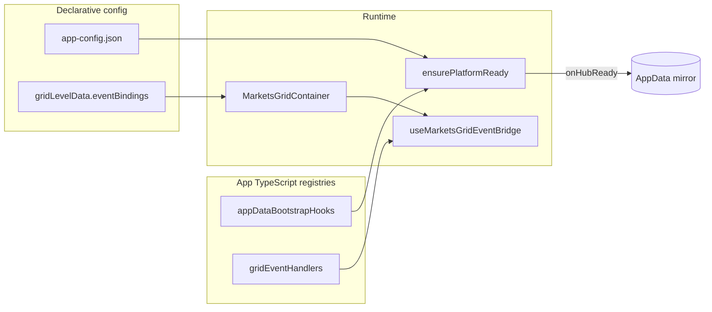

# Platform Hooks + Grid Events — Demo App

Interactive browser demo for **AppData bootstrap hooks** and **MarketsGrid event callbacks**. No STOMP broker required — uses mock data providers and a live sidebar (guide, AppData mirror, event log).

---

## Quick start

From repo root:

```bash
npm install
npm run dev:platform-hooks-demo
# → http://localhost:5214
```

`STARUI_DEV_SOURCE=1` is set on the dev script so Vite resolves `@wellsfargo-starui/*` from live `packages/` source.

---

## What you will see

| Area | Feature |
|------|---------|
| **Left sidebar → Guide** | Step-by-step checklist for every new capability |
| **Left sidebar → AppData** | Rows seeded by bootstrap hooks (`SessionContext`, `DeskDefaults`, `positions.asOfDate`) |
| **Left sidebar → Events** | Real-time log when bound grid event handlers fire |
| **Main grid** | Mock positions blotter with Custom Settings (provider + event bindings) |

Press **Alt+Shift+S** anytime for the hub inspector (providers, AppData, subscribers).

---

## Architecture (two-tier hooks)



**Rule:** only **stable ids** are persisted in JSON/storage — never executable code.

---

## Feature 1 — AppData bootstrap

### Config — `public/app-config.json`

```json
{
  "appDataBootstrap": {
    "onHubReady": ["session-context", "desk-defaults"],
    "runPolicy": "if-missing",
    "targets": {
      "session-context": ["SessionContext"],
      "desk-defaults": ["DeskDefaults", "positions"]
    }
  }
}
```

### Code — `src/platform/appDataBootstrap.ts`

Export a map of hook id → async function. Each hook receives `upsertAppData`, `fetchJson`, mirror read, etc.

### Wire — `src/bootstrap.ts`

```typescript
platform = await ensurePlatformReady(config, {
  workerScriptUrl: workerAssetUrl,
  appDataBootstrapHooks,
});
```

### How to test

1. Open the **AppData** sidebar tab after load — expect `SessionContext`, `DeskDefaults`, and `positions`.
2. Reload the page — hooks **skip** (if-missing) because providers already exist.
3. DevTools → Application → IndexedDB → clear AppData rows → reload — hooks run again.
4. Console shows `[bootstrap] …` lines from `ctx.log()`.

See also: [`docs/guides/platform-bootstrap-config.md`](../../docs/guides/platform-bootstrap-config.md#appdata-bootstrap-hooks).

---

## Feature 2 — Grid event callbacks

### Handler registry — `src/platform/gridEventHandlers.ts`

Eight demo handlers write to the sidebar **Events** log (and you can add `console.log`):

| Handler id | Typical event binding |
|------------|----------------------|
| `log-profile-saved` | `profile:saved` |
| `log-profile-loaded` | `profile:loaded` |
| `log-provider-status` | `provider:status` |
| `log-provider-switched` | `provider:switched` |
| `log-data-stale` | `provider:dataStale` |
| `log-toolbar-date` | `toolbar:dateChanged` |
| `log-cell-clicked` | `grid:cellClicked` |
| `log-filter-changed` | `grid:filterChanged` |

Labels for Custom Settings come from `src/platform/hooksMeta.ts`.

### Persistence — `gridLevelData` (grid-level)

Bindings are stored in the versioned envelope:

```typescript
{
  v: 1,
  provider: { liveProviderId, historicalProviderId, mode },
  eventBindings: { "profile:saved": ["log-profile-saved"] }
}
```

They **survive profile switches** — unlike profile modules, bindings are not per-profile.

### How to test

1. Toolbar **settings** (gear) → module dropdown → **Custom Settings**.
2. Enable handlers via the **dropdown** under each event group (platform / provider / toolbar / grid).
3. Perform the action (save profile, click cell, change filter, pick toolbar date, etc.).
4. **Events** tab updates immediately.
5. Reload — dropdown selections persist (stored in localStorage via `createMarketsGridLocalStorageStorage()`).

Full event catalog: `@wellsfargo-starui/grid` → `MARKETS_GRID_EVENT_CATALOG`.

---

## Source files

| File | Role |
|------|------|
| `public/app-config.json` | Platform identity + `appDataBootstrap` manifest |
| `src/bootstrap.ts` | `ensurePlatformReady` + hook registry |
| `src/platform/appDataBootstrap.ts` | AppData seed hooks |
| `src/platform/gridEventHandlers.ts` | Grid event handler implementations |
| `src/platform/hooksMeta.ts` | Custom Settings handler labels |
| `src/mockProvider.ts` | Mock live + historical catalog drafts |
| `src/App.tsx` | Seed providers + `MarketsGridContainer` |
| `src/components/DemoSidebar.tsx` | Guide / AppData / Events UI |
| `src/state/eventLogStore.ts` | In-memory pub/sub for event log |

---

## Comparison with `stomp-marketsgrid-minimal`

| | **platform-hooks-demo** | **stomp-marketsgrid-minimal** |
|--|-------------------------|-------------------------------|
| Data | Mock (no broker) | Live STOMP |
| UI | Sidebar + event log | Full-screen grid only |
| Scope | All hook features | Minimal STOMP attach path |
| Port | 5214 | 5213 |

Use **this app** to learn and test hooks. Use **stomp-minimal** to verify STOMP + hub attach.

---

## Troubleshooting

| Symptom | Fix |
|---------|-----|
| **Grid shows no rows / empty columns** | Mock cfg needs `columnDefinitions` + `keyColumn: 'id'`. Reload — cfg v2 re-persists automatically. Still empty? Clear `localStorage['platform-hooks-demo.mock-cfg-version']` and reload, or wipe IndexedDB `marketsui-config`. |
| Blank “Seeding mock providers…” | Wait for IndexedDB catalog write; check console for errors |
| AppData tab empty | Hub not ready — check bootstrap console; verify hooks in `app-config.json` |
| Events tab never updates | Bind handlers in Custom Settings first; handlers only fire for checked events |
| Stale bindings after code change | Clear localStorage keys `marketsgrid-*` or use DevTools → Application |
| Hub inspector empty | Grid must mount and attach a provider first |

---

## Further reading

- **[Platform hooks demo guide](../../docs/guides/platform-hooks-demo.md)** — exhaustive walkthrough + API reference
- **[Platform bootstrap config](../../docs/guides/platform-bootstrap-config.md)** — `app-config.json` fields
- **[MarketsGrid usage guide](../../docs/MARKETSGRID_USAGE_GUIDE.md)** — grid hosting scenarios
