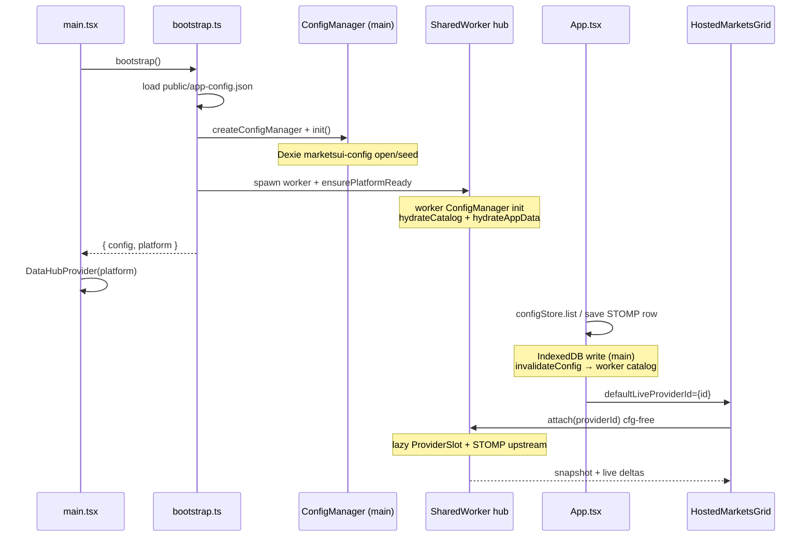

# STOMP + MarketsGrid — minimal

Lean browser demo that shows the smallest end-to-end path:

**platform bootstrap → SharedWorker hub → catalog provider row → cfg-free grid attach → live STOMP rows.**

No OpenFin, no routing, no provider editor UI — full-screen `HostedMarketsGrid` only.

---

## Prerequisites

| Requirement | Notes |
|-------------|--------|
| **Monorepo install** | From repo root: `npm install` |
| **STOMP broker** | [`stomp-view-server`](../../apps/demos/stomp-view-server) on `ws://localhost:8081` — matches `src/stompProvider.ts` |
| **Node 20+** | Same as root `package.json` engines |

Optional for local package development:

- `STARUI_DEV_SOURCE=1` is already set on the app's `dev` script. Vite resolves `@wellsfargo-starui/*` from live `packages/` source instead of `libs/*.tgz` tarballs.
- If you change worker/hub code, rebuild the worker asset once: `npm run build --workspace=@wellsfargo-starui/host-data` (or full `npm run build` from root).

### STOMP topics

The seeded provider uses tag **`TRADER001`**:

- Subscribe: `/snapshot/positions/TRADER001`
- Request: `/snapshot/positions/TRADER001/1000/50`
- Snapshot end token: `Success`

Start the broker **before** opening the app, or the grid will attach and sit in `loading` / `error` until the WebSocket is reachable.

---

## Run

Terminal 1 — STOMP broker:

```bash
npm run dev:stomp
```

Terminal 2 — this app:

```bash
npm run dev:stomp-marketsgrid-minimal
# → http://localhost:5213
```

In development, press **Alt+Shift+S** to open the hub inspector (running providers, subscribers, cache row counts, loaded cfg JSON).

---

## Implementation flow

High-level sequence from cold start to grid rows:



### Phase 1 — Boot (before React renders)

`src/main.tsx` awaits `bootstrap()` **before** mounting the tree.

`src/bootstrap.ts`:

1. Reads `public/app-config.json` (`appId`, `userId`, local vs REST).
2. Calls `ensurePlatformReady(config, { workerScriptUrl })`, which:
   - Creates and **`init()`s** a **main-thread** `ConfigManager` (IndexedDB / optional REST).
   - Spawns the **SharedWorker** (`@wellsfargo-starui/host-data` default entry).
   - In the worker: second `ConfigManager` + `hydrateCatalog()` + `hydrateAppData()` from IndexedDB.
   - Waits until AppData mirror + worker catalog are ready.
3. Returns `platform` (`client`, `appData`, `configManager`, …).

### Phase 2 — React context

`DataHubProvider` does **not** run bootstrap again when `platform` is passed in. It wraps the app with:

- `client` — MessagePort to the SharedWorker
- `appData` — main-thread mirror of AppData rows
- `configStore` — `DataProviderConfigStore` over the main-thread `ConfigManager` (provider editor / programmatic save)

### Phase 3 — Seed catalog row (App mount)

`src/App.tsx`:

1. `configStore.list(userId, { subtype: 'stomp' })` — read existing STOMP providers from IndexedDB.
2. If `"STOMP Positions"` exists, reuse its `providerId`; else `configStore.save(stompProviderDraft)`.
3. Save writes an `appConfig` row (`componentType: data-provider`) and calls `client.invalidateConfig()` so the **worker catalog cache** picks up the new row.

Provider definition lives in `src/stompProvider.ts` (WebSocket URL, topics, columns, `keyColumn`).

### Phase 4 — Grid attach (cfg-free)

Once `providerId` is known, `HostedMarketsGrid` mounts with:

- `defaultLiveProviderId={providerId}` — hub resolves transport cfg from **worker catalog**; no inline `cfg` prop.
- `withStorage` + `configManager` — grid layout / picker persistence via the same main-thread `ConfigManager`.

First attach for that id **lazy-starts** the STOMP provider in the worker: one upstream connection, one row cache, fan-out to the grid.

---

## Source files

| File | Role |
|------|------|
| `public/app-config.json` | Platform identity (`appId`, `userId`, `useRest`) |
| `src/bootstrap.ts` | `ensurePlatformReady` + cached `platform` handle |
| `src/main.tsx` | Theme, boot gate, `DataHubProvider`, render `App` |
| `src/stompProvider.ts` | STOMP transport cfg + column defs (catalog payload) |
| `src/App.tsx` | Idempotent catalog seed + `HostedMarketsGrid` |
| `src/platform/appDataBootstrap.ts` | *(optional)* AppData bootstrap hooks (console demo) |
| `src/platform/gridEventHandlers.ts` | *(optional)* Grid event handler registry (console demo) |
| `src/platform/hooksMeta.ts` | Labels if wiring `handlerMeta` on the grid container |
| `src/globals.css` | Design-system + grid styles |

Supporting config only: `vite.config.ts` (port **5213**, SharedWorker bundling), Tailwind/PostCSS.

---

## What this app intentionally skips

- Provider editor / picker toolbar (use **Alt+Shift+P** apps like `markets-grid-lab` for that UX)
- OpenFin platform shell, Config Browser view, routing
- AppData template vars (`{{name.key}}`) — not needed for this fixed STOMP cfg
- REST config service (`useRest: false` — local Dexie only)

Use this app to verify **hub bootstrap**, **catalog persistence**, and **cfg-free STOMP attach**. For authoring providers in UI, see `apps/demos/dataprovider-editor` or `apps/demos/markets-grid-lab`. For **AppData bootstrap + grid event callbacks** with mock data (no broker), see [`apps/demos/platform-hooks-demo`](../platform-hooks-demo/README.md).

---

## Troubleshooting

| Symptom | Check |
|---------|--------|
| Blank screen briefly, then grid | Normal — `App` returns `null` until catalog seed resolves |
| Grid empty / `loading` forever | Is `npm run dev:stomp` running? WebSocket `ws://localhost:8081` reachable? |
| Provider not in hub inspector | Open **Alt+Shift+S** after grid mounts; look for running slot + row count |
| Stale hub code after package edits | Rebuild `@wellsfargo-starui/host-data` worker asset; restart Vite |
| IndexedDB state from old runs | DevTools → Application → IndexedDB → `marketsui-config` → clear `appConfig` |

---

## Further reading

- **[MarketsGrid Usage Guide](../../docs/MARKETSGRID_USAGE_GUIDE.md)** — full scenario matrix (this app is **Scenario A**)
- **[STOMP DataProvider guide](../../docs/STOMP_DATAPROVIDER_MARKETSGRID_GUIDE.md)** — step-by-step STOMP wiring from scratch
