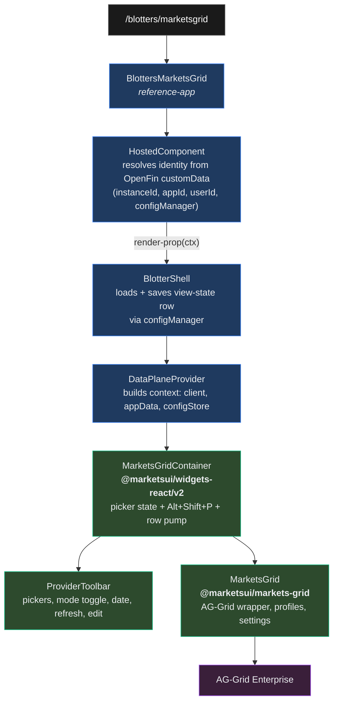
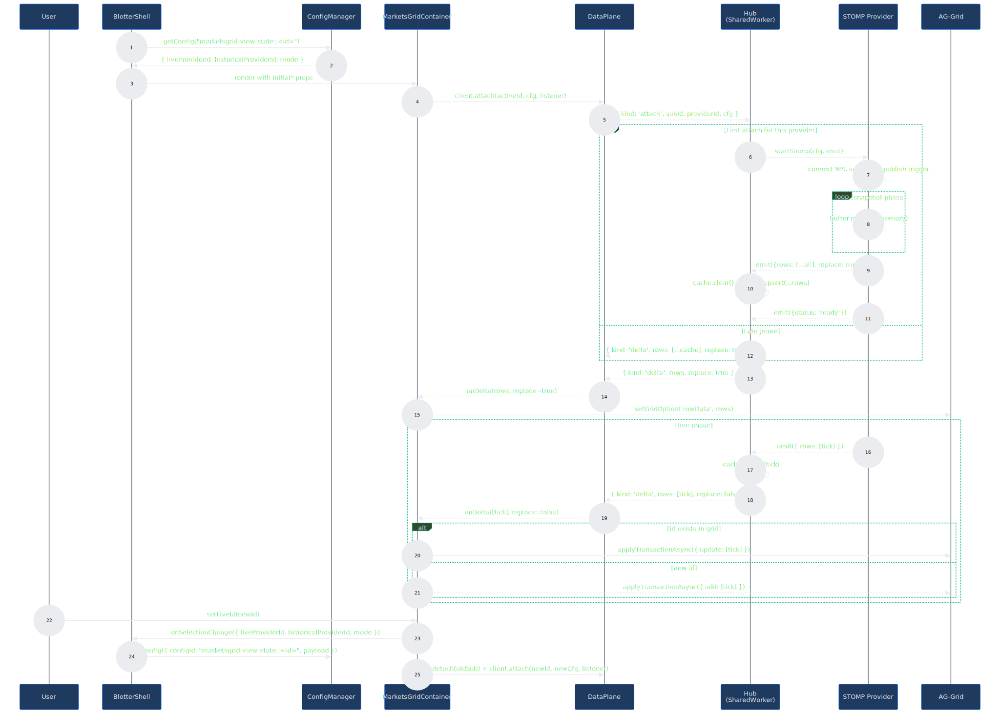
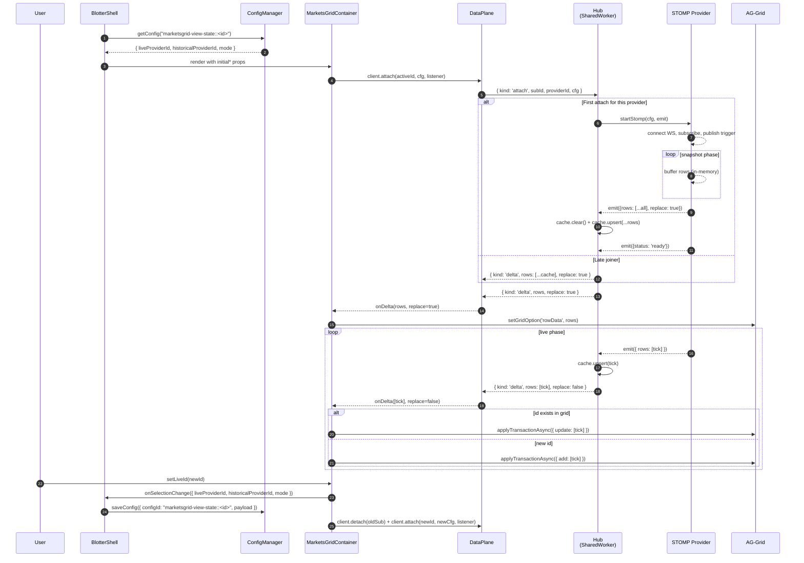
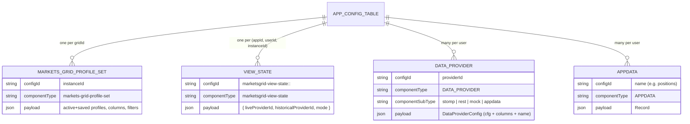

# Data Plane v2 — `<BlottersMarketsGrid>` ⇆ `<MarketsGridContainer>` ⇆ `<MarketsGrid>`

Three diagrams describing how the reference app's blotter route mounts
the v2 data-plane container and the AG-Grid wrapper, how rows flow
through the SharedWorker Hub, and what the persisted ConfigManager
rows look like.

Source files referenced throughout:

| Component                  | Package / path                                                         |
|----------------------------|------------------------------------------------------------------------|
| `<BlottersMarketsGrid>`    | `apps/markets-ui-react-reference/src/views/BlottersMarketsGrid.tsx`    |
| `<HostedComponent>`        | `apps/markets-ui-react-reference/src/components/HostedComponent.tsx`   |
| `<DataPlaneProvider>`      | `packages/data-plane-react/src/v2/index.tsx`                           |
| `<MarketsGridContainer>`   | `packages/widgets-react/src/v2/markets-grid-container/`                |
| `<ProviderToolbar>`        | `packages/widgets-react/src/v2/markets-grid-container/ProviderToolbar.tsx` |
| `<MarketsGrid>`            | `packages/markets-grid/src/MarketsGrid.tsx`                            |
| `Hub`                      | `packages/data-plane/src/v2/worker/Hub.ts`                             |
| `startStomp` / `startRest` | `packages/data-plane/src/v2/providers/{stomp,rest}.ts`                 |
| `ConfigManager`            | `packages/config-service/src/config-manager.ts`                        |

Pre-rendered SVGs of every diagram live in [`./diagrams/`](./diagrams/)
— regenerate with the script at the bottom of this file whenever the
sources below change.

---

## 1. Component hierarchy

How the React tree assembles around a single blotter mount. `BlottersMarketsGrid`
is reference-app glue; everything below `<DataPlaneProvider>` is reusable
across consumers.





### Boundary-by-boundary

- **Route → BlottersMarketsGrid** — React Router mounts the view.
- **BlottersMarketsGrid → HostedComponent** — opaque identity resolution
  from OpenFin `customData` (or URL fallback): `instanceId`, `appId`,
  `userId`, plus the singleton `configManager`. Children render through
  a render-prop only after all four resolve.
- **HostedComponent → BlotterShell** — receives the resolved context.
  Owns the ConfigManager round-trip for the **provider selection
  view-state row** (load on mount, save on every `onSelectionChange`).
- **BlotterShell → DataPlaneProvider** — supplies `client` (the
  main-thread DataPlane facade over the SharedWorker), the `userId`
  scope, and `configManager`. The provider lazily constructs the
  `AppDataStore` and `DataProviderConfigStore` per `(client,
  configManager, userId)` triple.
- **DataPlaneProvider → MarketsGridContainer** — fully reusable. Picker
  state, hotkey, AppData-driven template resolution, row pump.
- **MarketsGridContainer → ProviderToolbar** — UI for picker selection,
  mode toggle, date picker, refresh, edit-popout.
- **MarketsGridContainer → MarketsGrid → AG-Grid** — the grid receives
  `rowIdField` and `columnDefs` from the active provider's saved cfg;
  rows are fed imperatively through the captured `gridApi`.

---

## 2. Data flow — initial mount + live tick + selection change

A time-ordered trace of the three lifecycle events the v2 plane
treats as first-class:

1. **Initial attach** — provider lazily created on first attach;
   STOMP buffers the snapshot phase and flushes as one
   `replace: true` event when the end-token arrives. Late-joiners
   replay against the Hub's cache instead.
2. **Live tick** — keyed delta. The container splits each batch into
   `add` vs `update` based on `api.getRowNode(id)` so ticks for new
   rows that arrived after the snapshot don't trip AG-Grid error #4.
3. **Selection change** — when the user mutates the picker, the
   container emits `onSelectionChange` (gated by a
   StrictMode-safe `lastSavedRef` comparison) and the BlotterShell
   writes the new row.





### Notable invariants

- **Hub never auto-tears-down**: providers run from the first attach
  until `stop` is explicit (Diagnostics tab Stop button) or the
  SharedWorker dies. Mode-toggle switches between live/historical
  *attach* targets but neither provider closes its upstream socket.
- **Snapshot ⇒ rowData, delta ⇒ transaction**: the only way to push
  rows is through one of two AG-Grid APIs. `replace: true` always
  goes to `setGridOption('rowData', …)`. Keyed deltas always go
  through `applyTransactionAsync({ add, update })`.
- **AppData drives template re-attach**: changing
  `positions.asOfDate` (via the toolbar's date picker, or any other
  AppData mutation) re-resolves the cfg through `useResolvedCfg`,
  which flips its identity, which fires the
  `useProviderStream` re-attach effect, which the Hub turns into a
  `provider.restart(extra)` — one code path, two surfaces.

---

## 3. Persistence model — rows in the host ConfigManager

Every per-app, per-user, per-instance bit of state lives as an
`AppConfigRow` in `ConfigManager`. The `componentType` discriminator
keeps the row classes from colliding; the `(appId, userId, configId)`
triple is the unique key from a given owner's perspective.





### Row classes

| `componentType`              | Owner                              | Why it's separate                                                                                              |
|------------------------------|------------------------------------|----------------------------------------------------------------------------------------------------------------|
| `markets-grid-profile-set`   | `<MarketsGrid>` (per `gridId`)     | Big, frequently-mutated payload (column widths, sort/filter, formatting rules). Saved by the grid itself.      |
| `marketsgrid-view-state`     | `<BlotterShell>` (per `instanceId`)| Tiny, picker-only payload. Separate row keeps the profile-set hot path untouched on every selection change.    |
| `DATA_PROVIDER`              | Provider editor                    | Saved DataProviderConfig — cfg + inferred fields + columns + name. One row per saved provider.                 |
| `APPDATA`                    | AppDataProvider editor             | Plain key/value rows. Source of `{{name.key}}` template substitutions used by other DataProviderConfigs.       |

### Two windows on the same gridId

`gridId` and `instanceId` are the same scope key from the v2 container's
point of view. Two blotter windows on `(TestApp, dev1, blotter-A)`
share both rows; on `(TestApp, dev1, blotter-B)` they get independent
view-state and profile-set rows.

---

## Regenerating the diagrams

The `.mmd` sources live under [`docs/diagrams/`](./diagrams/). Each
diagram is checked in as:

| File suffix     | Format          | Use                                                    |
|-----------------|-----------------|--------------------------------------------------------|
| `.mmd`          | Mermaid source  | Edit this; everything else is regenerated from it.     |
| `.svg`          | Dark-theme SVG  | Default — embedded above. Vector, scales infinitely.   |
| `-light.svg`    | Light-theme SVG | Use on light backgrounds (e.g. printed handouts).      |
| `.png`          | Hi-res dark PNG | For slide decks / chat embeds where SVG isn't supported.|

To regenerate every output after editing a `.mmd`:

```bash
# from repo root
./docs/diagrams/render.sh
```

The script invokes `@mermaid-js/mermaid-cli` (`mmdc`) via `npx`, so no
permanent install is required. Theme variables are pinned in
[`.mermaid-config.json`](./diagrams/.mermaid-config.json) and
[`.mermaid-config-light.json`](./diagrams/.mermaid-config-light.json)
so colors match the design-system tokens (`--bn-bg`, `--bn-t0`, etc.).
