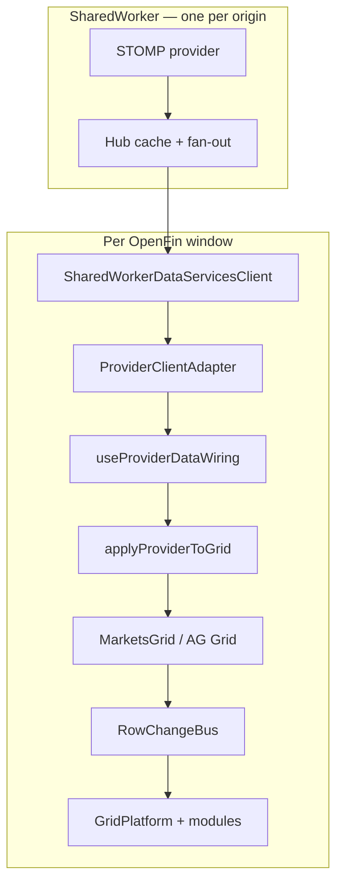

# MarketsGrid performance & memory audit

End-to-end audit of the **production MarketsGrid stack** — from STOMP/worker
through container wiring, AG Grid, and customizer engine modules.

Complements [`MEMORY_LEAK_AUDIT.md`](./MEMORY_LEAK_AUDIT.md) (host-data /
SharedWorker layer) and [`blotter-performance-roadmap.md`](./blotter-performance-roadmap.md)
(forward backlog).

_Last reviewed: 2026-06-17._

---

## Executive summary

| Dimension | Verdict |
|-----------|---------|
| **Memory leaks (listeners / timers / workers)** | **Good** — teardown paths are wired; June 2026 hardening addressed hub + client gaps |
| **Baseline live-tick CPU** | **Good** — `applyProviderToGrid` → `applyTransactionAsync` → `RowChangeBus` delta is lean |
| **Feature-dependent CPU** | **Risk** — conditional styling (timed/header rules) and virtual calculated columns can full-scan the grid every tick |
| **Scale (N windows × row count)** | **Operational** — per-renderer AG Grid + decode dominates; tune provider + grid defaults |

**Bottom line:** Subscription hygiene and grid teardown are production-ready.
Remaining performance work is **profile/feature tuning** and **module hot-path
optimization**, not missing `removeEventListener` calls on the main path.

---

## Production call stack



**Entry points:**

| App pattern | Files |
|-------------|-------|
| OpenFin blotter | `HostedMarketsGrid` → `MarketsGridContainer` |
| Bare grid | `MarketsGrid` + parent-owned `rowData` / provider |

---

## Layer 1 — Data pipeline (`host-data`)

See [`MEMORY_LEAK_AUDIT.md`](./MEMORY_LEAK_AUDIT.md) for full detail.

| Area | Memory | Performance |
|------|--------|-------------|
| Fan-out workers (1 per `subId`) | Terminated on detach / port close | Parallelizes hub `postMessage` |
| Hub cache + `replaySnapshot` | O(rows); cleared on provider idle-stop | Encode once, byte-copy per listener |
| Client heartbeats + `subscription-lost` | Timers cleared on detach | Re-attach without tearing React wiring |
| `thinSubs` row mirror | Bounded by row count | Faster thin-delta merge |
| `useProviderDataWiring` visibility pause | — | Skips `applyTransactionAsync` when hidden |

**Tuning knobs (provider config):** `throttleMs`, `conflateByKey`,
`projectFields`, `wireFormat: columnar` — see star-demo `seed.json` and
[`STOMP_DATAPROVIDER_MARKETSGRID_GUIDE.md`](./STOMP_DATAPROVIDER_MARKETSGRID_GUIDE.md).

---

## Layer 2 — Container wiring (`widgets-react`)

### `MarketsGridContainer.tsx`

| Check | Memory | Performance |
|-------|--------|-------------|
| `useDataProvider(..., { autoStart: false })` — wiring owns `start()` / `restart()` | `stop()` on provider effect cleanup | Avoids double-start races |
| `createMarketsGridContainerEventBus()` | Per-handler dispose on unmount | — |
| `reloadFromSource` flushes async queue before restart | — | Prevents stale pending adds |
| Loading overlay driven by snapshot / refetch / save state | — | User feedback only |

### `useProviderDataWiring.ts`

| Check | Memory | Performance |
|-------|--------|-------------|
| Unsubscribes `onRowsReceived`, `onSnapshotData`, `onTick`, `onStatus`, `onError` | ✅ cleanup | — |
| `visibilitychange` listener removed on cleanup | ✅ | Pauses ticks when `document.hidden`; one `refresh()` on resume |
| Snapshot path: `flushAsyncTransactions` → `markSnapshotLoaded` → `setGridOption('rowData', …)` | — | Correct ordering vs live ticks |
| `createApplyProviderToGridState()` per effect | Recreated on provider switch (no cross-leak) | Fresh `knownRowIds` index |

### `applyProviderToGrid.ts`

| Mechanism | Purpose |
|-----------|---------|
| `knownRowIds` Set | O(1) add vs update after snapshot (no `getRowNode` scan per tick) |
| `pendingAddIds` + coalescing | Dedupes rapid adds for same row id |
| `applyTransactionAsync` split add/update | AG Grid incremental path |

### `HostedMarketsGrid.tsx`

| Check | Memory |
|-------|--------|
| `beforeunload` / `pagehide` / OpenFin `destroyed` removed on unmount | ✅ |
| `useViewTabTitle` — `setInterval` cleared on unmount | ✅ |
| `useGridContextLink` — `selectionChanged` + interop listeners detached | ✅ |

### `useDataProvider.ts` (`host-data-react`)

| Check | Memory |
|-------|--------|
| Effect cleanup: `provider.stop()` + status/error unsub | ✅ |
| `ProviderClientAdapter.stop()` clears handler `Set`s | ✅ (2026-06-17) |

---

## Layer 3 — MarketsGrid widget (`react-grid/grid`)

### `MarketsGridSurface.tsx`

| Knob | Value | Effect |
|------|-------|--------|
| `asyncTransactionWaitMillis` | **0** | No extra 100ms batch window on top of worker throttle |
| `memo(..., surfacePropsEqual)` | on | Blocks AgGridReact prop churn from parent re-renders |
| `rowData` prop | snapshot only | Live path uses transactions, not `rowData` replacement |

### `useGridHost.ts` + `GridPlatform.ts`

| Check | Memory | Performance |
|-------|--------|-------------|
| `platform.destroy()` on `onGridPreDestroyed` | Runs all module disposers, `RowChangeBus.dispose()`, `api.detach()`, `pipeline.dispose()`, `resources.dispose()` | — |
| Store subscription rAF-coalesced; `cancelAnimationFrame` on unmount | ✅ | Batches pipeline invalidation |
| Post-mount `setGridOption` skips unchanged keys | — | Avoids AG Grid option churn |

### `RowChangeBus.ts` (engine)

Central optimization — **one** listener per grid instead of per-module
`modelUpdated` + `forEachNode` stacks.

| Behavior | Detail |
|----------|--------|
| Hot path | `asyncTransactionsFlushed` → delta of changed nodes only |
| Coalescing | 0ms timer (not rAF — alerts must fire when window hidden) |
| Structural | `rowDataUpdated` / `modelUpdated` → `change.full` fallback |
| Teardown | `dispose()` clears timer, listeners, handler set, pending maps |

### `useFilterCounts` (`useFilterModel.ts`)

| Mode | Cost | When |
|------|------|------|
| Delta (streaming) | Changed rows × active filter pills | Default when toolbar filters on |
| Full recompute | `forEachNode` × filters | Structural events only |
| Retention | `Map<filterId, Set<rowId>>` | Bounded by rows × filters |

**Note:** `showFiltersToolbar` defaults **off** — zero cost unless enabled.

### Stream-safe filters + QuickSearch

| Component | Cleanup | Perf |
|-----------|---------|------|
| `streamSafeFloatingFilterBase` | `destroy()` clears debounce + DOM listeners | Debounced input |
| `buildStreamSafeComponents` | — | Omits date parser unless column defs need it |
| `QuickSearch.tsx` | Debounce timer cleared on unmount | 140ms debounce before `quickFilterText` |

### `useMarketsGridController.ts`

| Check | Memory |
|-------|--------|
| `beforeunload` only when dirty; removed on unmount | ✅ |
| `saveFlashTimer` cleared before reschedule | ✅ |

---

## Layer 4 — Customizer engine modules (feature-gated cost)

These modules mount via `GridPlatform` when present in the profile. They
determine **most of the per-tick CPU variance** beyond the baseline path.

### Alerts (`alerts/runtime/activate.ts`)

| Aspect | Assessment |
|--------|------------|
| Hot path | **Delta** via `RowChangeBus` when rules enabled |
| Retention | `prevValues`, `knownRowIds` — grow with rows; pruned on remove/teardown |
| Rare path | `runFullPass` → full `forEachNode` on structural `change.full` |
| Severity | **Low–Med** (many rules × large delta batches) |

### Conditional styling (`conditional-styling/runtime/activate.ts`)

| Aspect | Assessment |
|--------|------------|
| Hot path | `platform.rows.subscribe` → `timed.processTimedActivations()` + `headerPainter.evaluate()` on **every** coalesced row change |
| Scan type | **Full grid** `forEachNode` / `forEachNodeAfterFilter` (ignores delta payload) |
| Mitigation | rAF-coalesced `refreshCells`; rule gating (`hasHeaderPaintRules`) |
| Severity | **High** when timed or header-flash rules are enabled |

```81:86:packages/react-grid/grid/src/customizer/modules/conditional-styling/runtime/activate.ts
  disposers.push(platform.rows.subscribe(() => {
    timed.processTimedActivations();
    if (hasHeaderPaintRules(platform.getState())) {
      headerPainter.evaluate();
    }
  }));
```

**Recommendation:** For streaming blotters, prefer cell-level rules without
timed/header scans; or accept CPU cost and keep `animateRows: false`.

### Calculated columns (`calculated-columns/index.ts`)

| Aspect | Assessment |
|--------|------------|
| Hot path | `rowDataUpdated` (+ cell edits) → invalidate all-rows cache → `refreshCells({ force: true })` on **every** virtual column |
| Cost | Fires on essentially every streaming tick when virtual columns exist |
| Severity | **High** when `virtualColumns.length > 0` |

```71:79:packages/react-grid/grid/src/customizer/modules/calculated-columns/index.ts
    const onDataEvent = () => {
      const api = platform.api.api;
      if (!api) return;
      invalidateAllRowsCache(api, cache);
      const ids = platform.getState().virtualColumns.map((v) => v.colId);
      if (ids.length === 0) return;
      try { api.refreshCells({ columns: ids, force: true }); }
      catch { /* teardown window */ }
    };
```

**Recommendation:** Avoid virtual aggregate columns on high-frequency live
blotters; pre-compute in the provider or use source columns only.

### Other modules (lower streaming impact)

| Module | Notes |
|--------|-------|
| `data-change-history` | `cellValueChanged` listener; disposed on teardown |
| `toolbar-date-settings` | Platform state subscription |
| `general-settings` | `debounceVerticalScrollbar: true`, `animateRows: false` defaults for streaming |

---

## Hot-path cost model (every live tick)

| Stage | Typical cost | Gated by |
|-------|--------------|----------|
| Worker conflate + throttle | Low (config) | `throttleMs`, `conflateByKey` |
| Main-thread decode | Med | `wireFormat`, row width |
| `applyProviderToGrid.applyTick` | Low | Changed row count |
| `applyTransactionAsync` + flush (`waitMillis=0`) | Low–Med | Changed row count |
| `RowChangeBus` emit | Low | Coalesced per frame |
| Alerts (enabled rules) | Low–Med | Rule count |
| **Conditional styling (timed/header)** | **High** | Rules present |
| **Calculated virtual columns** | **High** | `virtualColumns.length > 0` |
| Filter pill counts | Med | `showFiltersToolbar` |
| Quick search | Med | Active query |

---

## Memory risk register (ranked)

| # | Item | Category | Severity | Notes |
|---|------|----------|----------|-------|
| 1 | N OpenFin windows × AG Grid row model | Operational | **High** | Expected; tune provider projection |
| 2 | Hub cache (one per provider) | Intentional | Med | Cleared on idle-stop |
| 3 | `thinSubs` / filter `matchSets` / alert `prevValues` | Intentional | Low–Med | Bounded by row count |
| 4 | Fan-out workers | Intentional | Low | 1 per active `subId`; terminated on detach |
| 5 | `ProviderClientAdapter` handler `Set`s | Fixed | Low | Cleared on `stop()` |
| 6 | Inline `MessagePort` listeners (`FANOUT=0`) | Fixed | Low | `PortLike.dispose()` on port close |
| 7 | Module disposers not running | Low | Low | `GridPlatform.destroy()` is single path |
| 8 | `agGridSetFilterValidateGuard` window listeners | Intentional | Low | Page lifetime |

---

## Performance risk register (ranked)

| # | Item | Severity | Mitigation |
|---|------|----------|------------|
| 1 | Conditional styling timed + header rules | **High** | Disable rules or accept cost; profile without them for streaming |
| 2 | Virtual calculated columns on live feed | **High** | Zero virtual columns on tick blotters |
| 3 | Many alert rules × wide delta batches | Med | Rule pruning; worker conflation |
| 4 | Filter toolbar with many pills + 20k rows | Med | Keep toolbar off or limit pills |
| 5 | `animateRows: true` on streaming profile | Med | `animateRows: false` in seed/config |
| 6 | Worker throttle disabled | Med | `throttleMs: 100` + `conflateByKey` |
| 7 | Dev-mode Vite + StrictMode double-mount | N/A (dev) | Judge in production build |

---

## Optimizations already in place

1. **RowChangeBus** — single coalesced delta bus (replaced stacked full-grid scans).
2. **`applyProviderToGrid`** — `knownRowIds`, pending-add dedup, coalesced updates.
3. **`MarketsGridSurface`** — memo + `asyncTransactionWaitMillis={0}`.
4. **`useGridHost`** — rAF-coalesced pipeline; selective `setGridOption`.
5. **`PipelineRunner`** — per-module transform memoization.
6. **Alerts** — delta path gated on enabled rules.
7. **Conditional styling schedulers** — rAF `refreshCells`, targeted refresh.
8. **host-data** — fan-out workers, columnar wire, visibility pause, idle provider teardown.
9. **Stream-safe filters** — conditional bundle load; debounced inputs.
10. **`useFilterCounts`** — incremental delta updates (not full scan per tick).

---

## Monitoring playbook

### Automated (CI)

```bash
# Hub lifecycle regressions
npm test --workspace=@wellsfargo-starui/host-data -- src/runtime/memoryLifecycle.test.ts

# Grid hot-path unit tests
npm test --workspace=@wellsfargo-starui/grid -- applyProviderToGrid
npm test --workspace=@wellsfargo-starui/engine -- RowChangeBus
```

### Manual — multi-blotter memory churn

1. Production build (not Vite dev).
2. Chrome Memory: baseline → open 5 blotters → steady STOMP → close 4 → GC → repeat 10×.
3. Pass: retained `Detached`, `Worker`, `MessagePort` counts plateau.

See [`MEMORY_LEAK_AUDIT.md` § Monitoring](./MEMORY_LEAK_AUDIT.md).

### Manual — CPU / jank under load

1. Performance panel: record 30s with 3+ blotters + live STOMP.
2. Look for long tasks in:
   - `applyTransactionAsync` / `asyncTransactionsFlushed`
   - `processTimedActivations` / `headerPainter.evaluate`
   - `refreshCells` (calculated columns)
3. Compare profile **with vs without** conditional styling / virtual columns.

### Runtime introspection

- Provider Diagnostics tab: subscriber count, cache size, publish rate.
- `hub-introspect` RPC: stale subscribers, `keyDropCount`.

---

## Profile recommendations for streaming blotters

| Setting | Recommended | Avoid |
|---------|-------------|-------|
| `animateRows` | `false` | `true` on tick feeds |
| `throttleMs` / conflate | `100` + key column | Unthrottled STOMP |
| `projectFields` / columnar | on for wide feeds | Full-row JSON fan-out |
| `showFiltersToolbar` | off unless needed | Many pills on 20k rows |
| Conditional styling | cell rules only | Timed + header flash rules |
| Calculated columns | none on live path | Virtual aggregates |
| `contextLink` | off in perf testing | Debug logging on |
| `hubInspector` | `false` in demos | Dev overlay in soak tests |

---

## Recommended follow-ups

| Priority | Item | Layer |
|----------|------|-------|
| P1 | Wire conditional styling timed/header to `RowChangeBus` delta (not full scan) | engine |
| P1 | Gate calculated-column `rowDataUpdated` refresh — delta or throttle | engine |
| P2 | memlab / Playwright churn script for multi-blotter open/close | e2e |
| P2 | Production-build soak doc in `E2E_STATUS.md` | docs |
| P3 | Expose hub subscriber count in test harness assertion | e2e |

---

## Canonical file reference

| Layer | Path |
|-------|------|
| Surface / AG Grid | `packages/react-grid/grid/src/widget/MarketsGridSurface.tsx` |
| Host lifecycle | `packages/react-grid/grid/src/widget/useGridHost.ts` |
| Filter counts | `packages/react-grid/grid/src/widget/useFilterModel.ts` |
| Row change bus | `packages/shared/engine/src/platform/RowChangeBus.ts` |
| Platform destroy | `packages/shared/engine/src/platform/GridPlatform.ts` |
| Provider → grid | `packages/react-core/widgets-react/src/container/markets-grid-container/applyProviderToGrid.ts` |
| Wiring | `packages/react-core/widgets-react/src/container/markets-grid-container/useProviderDataWiring.ts` |
| Container | `packages/react-core/widgets-react/src/container/markets-grid-container/MarketsGridContainer.tsx` |
| Hosted shell | `packages/react-core/widgets-react/src/hosted/HostedMarketsGrid.tsx` |
| Alerts runtime | `packages/react-grid/grid/src/customizer/modules/alerts/runtime/activate.ts` |
| Conditional styling | `packages/react-grid/grid/src/customizer/modules/conditional-styling/runtime/activate.ts` |
| Calculated columns | `packages/react-grid/grid/src/customizer/modules/calculated-columns/index.ts` |
| Hub / client | `packages/data/host-data/` (see `MEMORY_LEAK_AUDIT.md`) |

---

## Related documentation

- [`MEMORY_LEAK_AUDIT.md`](./MEMORY_LEAK_AUDIT.md) — SharedWorker / fan-out / client layer
- [`CHANGELOG-2026-06-16.md`](./CHANGELOG-2026-06-16.md) — recent fixes
- [`blotter-performance-roadmap.md`](./blotter-performance-roadmap.md) — forward backlog
- [`hub-fanout-optimizations.md`](./hub-fanout-optimizations.md) — worker fan-out architecture
- [`MARKETSGRID_USAGE_GUIDE.md`](./MARKETSGRID_USAGE_GUIDE.md) — integration layers
