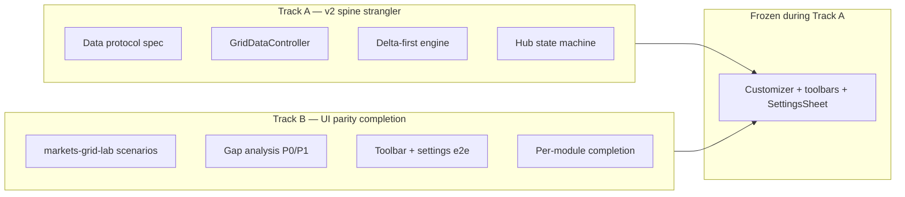
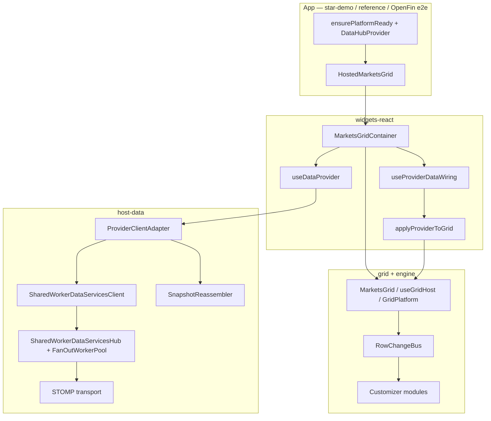

# MarketsGrid v2 strategy — strangler rewrite plan

Strategic plan for evolving MarketsGrid from an **experimentally grown v1**
into a **platform-grade v2**, using production experience as the specification
—not throwing away working behavior.

**Audience:** engineering leads, architects, product owners deciding between
incremental cleanup and a major rewrite.

**Related docs:**

| Document | Role |
|----------|------|
| [`MARKETSGRID_USAGE_GUIDE.md`](./MARKETSGRID_USAGE_GUIDE.md) | Current three-layer integration model |
| [`MARKETSGRID_PERF_AND_MEMORY_AUDIT.md`](./MARKETSGRID_PERF_AND_MEMORY_AUDIT.md) | Performance + memory baseline |
| [`MEMORY_LEAK_AUDIT.md`](./MEMORY_LEAK_AUDIT.md) | Host-data lifecycle audit |
| [`CHANGELOG-2026-06-16.md`](./CHANGELOG-2026-06-16.md) | Recent retroactive fixes (incident source) |
| [`MARKETSGRID_V2_DEPRECATION_LIST.md`](./MARKETSGRID_V2_DEPRECATION_LIST.md) | Phase 0 import inventory (living) |
| [`MARKETSGRID_UI_PARITY_TRACK.md`](./MARKETSGRID_UI_PARITY_TRACK.md) | Track B — UI preservation + gap backlog |
| [`MARKETSGRID_VS_ADAPTABLE_GAP_ANALYSIS.md`](./MARKETSGRID_VS_ADAPTABLE_GAP_ANALYSIS.md) | Product parity matrix |
| [`blotter-performance-roadmap.md`](./blotter-performance-roadmap.md) | Performance backlog |
| [`ARCHITECTURE.md`](./ARCHITECTURE.md) | Monorepo layer model |

---

## 1. Executive decision

| Question | Answer |
|----------|--------|
| Is a **full big-bang rewrite** justified? | **No** — too much validated edge-case behavior would be re-broken |
| Is **continued patch-only** sustainable? | **No** — integration debt and parallel paths will compound |
| **Recommended path** | **Strangler rewrite**: freeze a canonical spine, extract protocols, delta-first engine, delete parallel APIs behind conformance tests |
| **Explicit non-goal** | **Do not rewrite** the grid customizer, formatter toolbar, or settings panels — UI fidelity is incomplete and interdependent; a UI rewrite would fail |

**Principle:** v1 stays production until v2 passes a **parity + conformance**
gate. Experience from v1 becomes **tests and specs**, not copy-paste source.

**Critical scope boundary:** “v2” means **data spine + engine delta path + protocol
spec**. It does **not** mean rebuilding `@starui/grid/customizer` or the
formatter/toolbar chrome. Those surfaces ship as-is and are completed
incrementally on a separate **UI parity track** (see [§2.5](#25-ui-fidelity-constraint--why-a-full-ui-rewrite-fails)).

---

## 2. Honest assessment of v1

### What went well (keep the ideas)

- **SharedWorker hub** — one STOMP connection, one cache, multi-blotter fan-out
- **Snapshot reassembler** — chunked load, refresh, reconnect ordering
- **Incremental grid path** — `applyProviderToGrid` + `applyTransactionAsync`
- **`RowChangeBus`** — single coalesced delta signal (alerts use it correctly)
- **`GridPlatform` modules** — profiles drive alerts, styling, filters, calculated columns
- **Three-layer React model** — `MarketsGrid` / `MarketsGridContainer` / `HostedMarketsGrid`
- **OpenFin hardening** — identity gate, URL stamp, teardown flush

### What went wrong (fix in v2 shape)

| Symptom | Root cause |
|---------|------------|
| Fan-out redesigned 3× | No written fan-out contract before implementation |
| Replay / refresh / reconnect bugs | Protocol implicit across hub + client + reassembler |
| Conditional styling CPU cost | Module added before delta-first engine rule |
| `MarketsGridContainer` complexity | God-component: wiring + UI + persistence + provider lifecycle |
| Contributor confusion | Multiple “ways to run a blotter” still exported |
| Docs lag code | Features and fixes landed without updating the contract |

### Dead code — realistic estimate

Not ~50% landfill. Expect **~15–25% consolidatable**:

- Parallel data hooks (`useBlotterDataConnection` vs container wiring)
- Deprecated client APIs (`subscribe` with inline `cfg`, legacy types)
- Demo-only hosts that duplicate production patterns
- Excluded Angular buckets (source present, pipeline off)

**Action:** run the [import-graph audit](#7-import-graph--dead-code-audit) before
deleting anything.

### 2.5 UI fidelity constraint — why a full UI rewrite fails

Any attempt to **rewrite MarketsGrid including the UI layer** will fail. The
product surface is too large, too interdependent, and **not at total fidelity**
with desk expectations (AdapTable-class parity ≈ **48%** per
[`MARKETSGRID_VS_ADAPTABLE_GAP_ANALYSIS.md`](./MARKETSGRID_VS_ADAPTABLE_GAP_ANALYSIS.md);
migration parity from legacy StarUI ≈ **95%** per [`PARITY.md`](./PARITY.md) —
these are different questions).

#### What exists today (preserve, do not rewrite)

| Surface | Package path | Scope |
|---------|--------------|-------|
| **Settings sheet** + 18 customizer modules | `@starui/grid/customizer` | general-settings, column-templates, column-customization, conditional-styling, calculated-columns, column-groups, alerts, saved-filters, smart-edit, bulk-update, plus-minus, shortcuts, data-change-history, visual-excel, toolbar-visibility, toolbar-date-settings, grid-state |
| **Formatter toolbar** + popout panel | `@starui/grid` → `FormattingToolbar`, `formatter/*` | Scope / Type / Paint / Format / Templates / Clear — shared graph for inline + popout |
| **Primary / filters / editing toolbars** | `@starui/grid/widget` | Quick search, auto-format, filter pills, editing segments |
| **Column settings bands** | `ColumnSettingsPanel` | 10 bands (header → cell renderer editors) |
| **Style / expression editors** | `customizer/ui/*` | `StyleEditor`, `FormatterPicker`, `ExpressionEditor`, `ColorPicker`, Monaco DSL |

E2e coverage exists for many of these (`v2-formatting-toolbar`, `v2-column-customization`,
`v2-conditional-styling`, `v2-calculated-columns`, …). A rewrite would re-break
behaviour that took years of pixel-level tuning (popout portals, OpenFin
`alwaysOnTop`, theme tokens, draft/save cockpit pattern).

#### What is partial or missing (completion work, not rewrite)

| Gap | Coverage | Impact if you “rewrite UI” |
|-----|----------|---------------------------|
| AdapTable slot API (toolbar / tool panel / settings / popups) | ~50% | SDK exists; per-surface slots not exposed — rewrite would stall on API design |
| Pivot / aggregation layouts | thin | Desks expect it; no stable spec to rewrite against |
| Smart Edit (full AdapTable class) | partial | `smart-edit` + `EditingToolbar` exist; edge cases undocumented |
| Scheduled reports / team annotations | 0–25% | No UI to port — rewrite has no target |
| Standalone UP/DOWN flash module | partial | Per-rule flash in conditional-styling covers most cases |
| Expression engine — aggregation / observable / quantile families | partial | Calculated columns + alerts depend on current DSL |
| Formatter toolbar ↔ column-settings round-trip | mostly there | Subtle persistence bugs; rewrite reopens all of them |

**Conclusion:** The UI is a **living product backlog**, not a clean subsystem
ready for replacement. Treat it like a **library you extend**, not a layer you
swap.

#### Two-track model (mandatory)



| Track | Rewrites? | Goal |
|-------|-----------|------|
| **A — v2 spine** | Data wiring, hub protocol, engine hot path only | Reliable streaming blotter at scale |
| **B — UI parity** | **No wholesale rewrite** — extend modules in place | Close AdapTable gaps per [`gap analysis`](./MARKETSGRID_VS_ADAPTABLE_GAP_ANALYSIS.md) §8 |

Track A **must not** block on Track B. Gate C (pilot cutover) is spine-only.
Desk features ship on Track B without touching the data protocol.

**Execution backlog:** [`MARKETSGRID_UI_PARITY_TRACK.md`](./MARKETSGRID_UI_PARITY_TRACK.md)
— frozen UI inventory, preservation gates, gap → file map, per-PR checklist.

#### What “rewrite” means in this doc (narrow definition)

| In scope for v2 | Out of scope — preserve in place |
|-----------------|----------------------------------|
| `useProviderDataWiring` → `GridDataController` | `FormattingToolbar`, `formatter/*` |
| Hub attach/replay/reconnect protocol | `SettingsSheet`, all customizer panels |
| `RowChangeBus` delta for styling/calcs | `StyleEditor`, `FormatterPicker`, cell-renderer editors |
| Deprecate parallel data hooks | Toolbar layout, popout behaviour, theme chrome |
| Profile schema v2 **envelope** (migrations) | Per-module profile blob shapes (migrate, don't redesign UI) |

---

## 3. Canonical production spine (v1 truth)

Everything not on this path is **candidate for deprecation** unless it has an
explicit non-production role (lab, e2e, editor).



### Production apps using `HostedMarketsGrid` (2026-06-17)

| App | Role |
|-----|------|
| `apps/demos/star-demo` | Primary pilot (`BlottersMarketsGrid`) |
| `apps/demos/markets-ui-react-reference` | Production reference layout |
| `apps/demos/e2e-openfin-workspace` | OpenFin multi-blotter e2e |
| `apps/demos/e2e-browser-blotter` | Browser hub + hosted grid |
| `apps/demos/stomp`, `demo-stomp-markets-grid` | STOMP integration demos |
| `apps/demos/dataprovider-editor` | Editor embedded grid panel |

### Non-canonical paths (deprecation candidates)

| Path | Used by | v2 disposition |
|------|---------|----------------|
| `useBlotterDataConnection` | Legacy blotter hook consumers | Deprecate → migrate to `useDataProvider` + wiring |
| `useProviderStream` | Legacy stream API | Remove after grep confirms zero production imports |
| Direct `MarketsGrid` + manual `rowData` | `markets-grid-lab`, unit tests | **Keep** for lab only; document as non-production |
| `platform-hooks-demo` → direct `MarketsGridContainer` | Hooks demo | Keep demo; don't copy pattern |
| `marketsgrid-container-e2e` mock host | Container e2e | Keep test harness |
| Angular grid / widgets buckets | Excluded from build | Archive or delete in separate decision |

---

## 4. v2 target architecture

Same product capabilities; **cleaner boundaries**.

```text
┌─────────────────────────────────────────────────────────────┐
│  Presentation (React, per window)                           │
│  HostedShell · GridChrome · MarketsGridSurface              │
└───────────────────────────┬─────────────────────────────────┘
                            │
┌───────────────────────────▼─────────────────────────────────┐
│  GridDataController (no JSX)                                  │
│  snapshot commit · applyTick · visibility · stale banner state  │
└───────────────────────────┬─────────────────────────────────┘
                            │
┌───────────────────────────▼─────────────────────────────────┐
│  Grid engine (framework-agnostic)                             │
│  GridPlatform · RowChangeBus · modules (delta-first mandate)  │
└───────────────────────────┬─────────────────────────────────┘
                            │
┌───────────────────────────▼─────────────────────────────────┐
│  Data client (per window)                                     │
│  ProviderAdapter · SnapshotReassembler                        │
└───────────────────────────┬─────────────────────────────────┘
                            │
┌───────────────────────────▼─────────────────────────────────┐
│  Data plane (per origin, SharedWorker)                        │
│  Hub state machine · cache · fan-out · transports             │
└─────────────────────────────────────────────────────────────┘
```

### Non-negotiable v2 rules

1. **Written protocol spec** — hub ↔ client events, state machine, RPCs (`refresh` vs `restart`)
2. **Delta-first engine** — no module may `forEachNode` on the streaming hot path
3. **One production data API** — `IDataProvider` + hub client; no parallel hooks
4. **Versioned profiles** — `schemaVersion` + migrations from day one
5. **Conformance tests** — every production incident becomes a named test case
6. **Introspect API** — same surface for Diagnostics tab and CI assertions

---

## 5. Strangler vs big-bang

| Criterion | Strangler (recommended) | Big-bang rewrite |
|-----------|-------------------------|------------------|
| Production risk | v1 runs until v2 gate passes | Long feature freeze or double maintenance |
| Edge-case retention | Incident tests pin behavior | High risk of re-breaking STOMP/OpenFin |
| Time to first value | Phases ship independently | Nothing usable until late |
| Team size | 2–4 engineers on v2 spine | Needs dedicated parallel team |
| Morale | “Cleaning the plane while flying” | “Fresh start” — until parity drags |

**Decision: strangler.** New code lands **alongside** v1; cutover is a flag or
app config, not a branch replacement.

---

## 6. Phased plan

### Phase 0 — Canon + inventory (4–6 weeks)

**Goal:** Everyone agrees what production is; nothing deleted yet.

- [ ] Publish this doc; link from `README.md` / `CLAUDE.md`
- [ ] Mark deprecated exports in `widgets-react` / `host-data` JSDoc
- [x] Run [import-graph audit](#7-import-graph--dead-code-audit); file [`MARKETSGRID_V2_DEPRECATION_LIST.md`](./MARKETSGRID_V2_DEPRECATION_LIST.md)
- [ ] Freeze new parallel data-entry APIs (PR review gate)
- [ ] Baseline perf: production build, 3–5 blotters, full trading profile (alerts + styling on)

**Exit gate:** Deprecation list reviewed; no undocumented “second paths” in new PRs.

---

### Phase 1 — Protocol + conformance harness (6–10 weeks)

**Goal:** Behavior defined outside implementation.

- [ ] `docs/MARKETSGRID_DATA_PROTOCOL.md` — attach, replay, tick, refresh, restart, reconnect, subscription-lost
- [ ] `packages/data/host-data/src/conformance/` — fake provider + port harness
- [ ] Port incident catalog ([§8](#8-incident--conformance-test-catalog)) to Vitest cases
- [ ] CI job: `npm test --workspace=@starui/host-data -- conformance`

**Exit gate:** ≥20 conformance cases green; hub refactor allowed only if tests stay green.

---

### Phase 2 — Extract `GridDataController` (6–8 weeks)

**Goal:** Thin `MarketsGridContainer`; testable wiring without JSX.

**Constraint:** Controller extraction only — **no** formatter toolbar, settings
sheet, or customizer panel changes in this phase.

- [ ] New `GridDataController` in `widgets-react` (or `host-data-react`)
- [ ] Move logic from `useProviderDataWiring` + snapshot commit path into controller
- [ ] `MarketsGridContainer` becomes chrome + controller hook
- [ ] Characterisation tests: same grid behavior before/after

**Exit gate:** Container LOC reduced ≥30%; zero e2e regressions on `demo-react` / hosted specs.

---

### Phase 3 — Delta-first trading modules (10–14 weeks)

**Goal:** Full trading profile at scale without disabling features.

**Constraint:** Engine/runtime changes under existing module IDs — **no** panel or
toolbar rewrites. UI modules keep their current React surfaces; only
`resolve` / `onRowChange` / invalidation paths change.

| Module | Work |
|--------|------|
| **Alerts** | Already delta — document as reference pattern |
| **Conditional styling (timed)** | `processTimedActivations` → RowChangeBus delta only |
| **Conditional styling (header)** | Scan columns with header rules + changed rows only |
| **Calculated columns** | Dependency graph; invalidate changed rows only |
| **Filter counts** | Already incremental — verify under delta path |

**Perf budget (coalesced frame, 1k changed rows, 20k displayed):**

| Module | Target |
|--------|--------|
| Alerts | < 3 ms |
| Conditional styling (all rules) | < 8 ms |
| Calculated columns (≤5 virtual) | < 5 ms |

**Exit gate:** Performance panel shows no >50ms long tasks during 30s STOMP soak with full profile.

---

### Phase 4 — Hub protocol cleanup (6–8 weeks, can overlap Phase 3)

**Goal:** One obvious state machine; no implicit `ready` edge cases.

- [ ] Explicit `ProviderSlot` + `Subscriber` states in code and docs
- [ ] Unify replay paths: attach vs `refresh-provider` share helper, differ only in `emitReady` policy
- [ ] Consolidate fan-out: single model doc (per-`subId` worker — current winner)

**Exit gate:** Conformance suite covers all attach/replay/reconnect cases without special-case comments in tests.

---

### Phase 5 — Deprecation + deletion (4–6 weeks)

**Goal:** One way to build a production blotter.

- [ ] Remove `useBlotterDataConnection` (or thin alias with `console.warn`)
- [ ] Remove deprecated `SharedWorkerDataServicesClient.subscribe(cfg)` paths
- [ ] Archive unused demos or move under `apps/demos/archive/`
- [ ] ESLint `no-restricted-imports` for deprecated paths

**Exit gate:** Import-graph audit shows only canonical spine in `star-demo` + reference + e2e hosts.

---

### Phase 6 — Profile schema v2 (6–10 weeks)

**Goal:** Safe evolution without “stale appId” class bugs.

- [ ] `GridProfileV2` envelope with `schemaVersion`
- [ ] Migration from v1 module blobs
- [ ] Separate **view state** (layout) vs **profile** (rules, columns) optional split

**Exit gate:** Round-trip tests: export profile → reload → identical grid behavior.

---

### Phase 7 — Cutover + soak (ongoing)

- [ ] Feature flag: `STARUI_GRID_V2=1` in pilot app
- [ ] OpenFin multi-blotter soak (10 windows, 30 min, STOMP chaos)
- [ ] memlab / heap churn script in CI (optional)
- [ ] Production sign-off checklist ([`MARKETSGRID_PERF_AND_MEMORY_AUDIT.md`](./MARKETSGRID_PERF_AND_MEMORY_AUDIT.md))

---

## 7. Import-graph & dead-code audit

Run before Phase 5 deletions.

### Commands

```bash
# Production spine consumers
rg "HostedMarketsGrid|MarketsGridContainer|useBlotterDataConnection|useProviderStream" apps/demos --glob "*.{ts,tsx}"

# Deprecated markers
rg "@deprecated" packages/react-core packages/data/host-data packages/react-grid

# Direct MarketsGrid (non-hosted) in apps
rg "from '@starui/grid'" apps/demos --glob "*.{ts,tsx}"
```

### Deliverable: [`MARKETSGRID_V2_DEPRECATION_LIST.md`](./MARKETSGRID_V2_DEPRECATION_LIST.md)

Initial inventory filed 2026-06-17. Re-run scan commands in that doc before Phase 5 deletions.

### Rules for deletion

1. **Zero production imports** (star-demo, reference, e2e hosts) for two releases
2. **Test migration** complete or test deleted with justification
3. **CHANGELOG + current-features** updated same PR

---

## 8. Incident → conformance test catalog

Each row is a **required** conformance or e2e test in v2. Sourced from v1 retroactive fixes.

| ID | Incident | Expected behavior | v1 fix reference |
|----|----------|-------------------|------------------|
| C-01 | Third blotter stalls under load | Fan-out cost ~flat in window count | Fan-out worker pool |
| C-02 | Hidden window stops receiving ticks | Extended ping grace; not evicted silently | `SUBSCRIBER_PING_TIMEOUT_HIDDEN_MS` |
| C-03 | Evicted subscriber, no UI feedback | `subscription-lost` + client re-attach | `handleSubscriptionLost` |
| C-04 | Workspace drag loses profile | Identity gate + URL stamp + teardown flush | `useHostedIdentity`, `appendLaunchIdentityParams` |
| C-05 | STOMP dies, grid stale after reconnect | Auto `refresh` on `error` → `ready` | `useProviderDataWiring`, reassembler |
| C-06 | Refresh view silent | Overlay + chunked replay status | `replayCacheToPort` |
| C-07 | Refresh view stops live ticks | Reassembler restores `settled` after cache refresh | `SnapshotReassembler` |
| C-08 | Empty attach emits `ready` too early | No `ready` on empty attach replay | `replayCacheToPort` attach mode |
| C-09 | Late joiner misses snapshot | Cache replay as `delta-bin` chunks + `ready` | `attachDataListener` |
| C-10 | Peer restart drops overlay on other windows | Provider `loading` broadcast to all subs | Hub slot registration order |
| C-11 | Background window CPU burn | Pause `applyTransactionAsync` when hidden | `useProviderDataWiring` visibility |
| C-12 | `restart()` clears user snapshot handlers | Handlers survive `detach` within `restart()` | `ProviderClientAdapter.stop` vs `detach` |
| C-13 | Port close leaves hub listeners | `onPortClosed` + `dispose()` on inline path | `PortLike.dispose` |
| C-14 | Multi-blotter attach/detach leak | Zero workers / timers after churn | `memoryLifecycle.test.ts` |

**E2e extensions (Playwright / OpenFin):**

- E-01: STOMP kill → restart → auto-recovery (no manual reload)
- E-02: Refresh view → ticks continue
- E-03: 3+ blotters open → customize → workspace restore

---

## 9. Product parity matrix (v2 “done” definition)

v2 platform is **not** “100% AdapTable.” v2 **platform spine** is done when:

### Must-have (trading blotter — non-negotiable)

| Capability | v1 status | v2 requirement |
|------------|-----------|----------------|
| Live STOMP streaming | ✅ | Same + protocol tests |
| Multi-blotter / SharedWorker | ✅ | Same |
| Profiles + ConfigService | ✅ | + schema v2 migrations |
| Alerts (data/relative/row change) | ✅ | Delta path only |
| Conditional styling + timed/sticky | ✅ | Delta path (perf fix) |
| Calculated columns | ✅ | Delta invalidation |
| Provider picker + historical mode | ✅ | Same |
| OpenFin identity + workspace save | ✅ | Same |
| Stale banner + refresh / reload | ✅ | Same + e2e |

### Should-have (desk parity — **Track B**, phased after spine)

See [`MARKETSGRID_VS_ADAPTABLE_GAP_ANALYSIS.md`](./MARKETSGRID_VS_ADAPTABLE_GAP_ANALYSIS.md) §8 recommendations. **Not** blockers for v2 spine cutover. Completed by **extending** existing customizer modules and toolbars — never a parallel UI stack.

### Won’t-have in v2 spine (explicit)

- **Full UI rewrite** (customizer, formatter toolbar, settings chrome)
- Angular grid bucket re-enable
- Server-side row model for live STOMP
- Full AdapTable pivot / scheduled reports / annotations

---

## 10. Decision gates (go / no-go)

### Gate A — Start Phase 3 (delta engine)

- [ ] Conformance harness ≥20 tests green
- [ ] Perf baseline captured (full trading profile)
- [ ] Product agrees alerts + styling stay enabled during perf work

### Gate B — Start Phase 5 (deletions)

- [ ] `GridDataController` extracted; container tests green
- [ ] Deprecation list approved
- [ ] No open P0 incidents on v1 spine

### Gate C — Pilot cutover (`STARUI_GRID_V2`)

- [ ] All C-01…C-14 conformance tests green
- [ ] E-01…E-03 e2e green on OpenFin suite
- [ ] 30 min multi-blotter soak pass (manual or automated)
- [ ] Rollback plan: flag off returns to v1 path

### Gate D — Deprecate v1 wiring

- [ ] star-demo + reference on v2 for ≥2 release cycles
- [ ] No consumer imports of deleted APIs (CI grep)

---

## 11. Team & process changes (avoid repeating v1)

| v1 habit | v2 rule |
|----------|---------|
| “Let’s rewrite the customizer while we’re here” | **Forbidden** — spine-only PRs; UI gaps go to Track B backlog |
| Feature lands, docs later | Protocol doc + `current-features.md` same PR |
| New hook “for demo convenience” | Must use canonical spine or live under `apps/demos/archive` |
| Module listens to `modelUpdated` | Must subscribe to `RowChangeBus` or justify in PR |
| Perf fix via seed only | Engine default + seed + conformance perf budget |
| OpenFin fix in hosted only | Conformance case + e2e where possible |

**PR checklist (MarketsGrid / host-data / engine):**

1. Does this add a second data-entry path?
2. Does any hot path call `forEachNode`?
3. Is there a conformance or unit test for the new behavior?
4. Does `docs/current-features.md` need a bullet?

---

## 12. Risk register

| Risk | Mitigation |
|------|------------|
| v2 never catches up; perpetual dual stack | Time-box phases; Gate C only for pilot |
| Deleting “dead” code breaks hidden consumer | Import-graph audit + two-release deprecation |
| Delta styling breaks timed rule semantics | Characterisation tests per rule type before refactor |
| Team splits across features and v2 | Allocate ≥50% capacity to spine until Gate C |
| AdapTable parity pressure derails spine | Separate “desk features” backlog from v2 spine |

---

## 13. Immediate next actions (this sprint)

1. **Review this doc** with leads — confirm strangler vs big-bang
2. ~~**Run import-graph commands** (§7) — create `MARKETSGRID_V2_DEPRECATION_LIST.md`~~ **Done** — see [`MARKETSGRID_V2_DEPRECATION_LIST.md`](./MARKETSGRID_V2_DEPRECATION_LIST.md)
3. **File conformance folder** — stub `C-01`…`C-05` from table in §8
4. **Schedule perf baseline** — star-demo, production build, full profile, 5 blotters
5. **PR policy** — add MarketsGrid checklist to review template

---

## 14. Document history

| Date | Change |
|------|--------|
| 2026-06-17 | Initial strategy — strangler plan, spine, phases, gates, incident catalog |
| 2026-06-17 | Phase 0 deliverable: [`MARKETSGRID_V2_DEPRECATION_LIST.md`](./MARKETSGRID_V2_DEPRECATION_LIST.md); cross-links in audit docs |
| 2026-06-17 | §2.5 UI fidelity constraint — two-track model; explicit non-goal of UI rewrite |
| 2026-06-17 | Link to [`MARKETSGRID_UI_PARITY_TRACK.md`](./MARKETSGRID_UI_PARITY_TRACK.md) |
