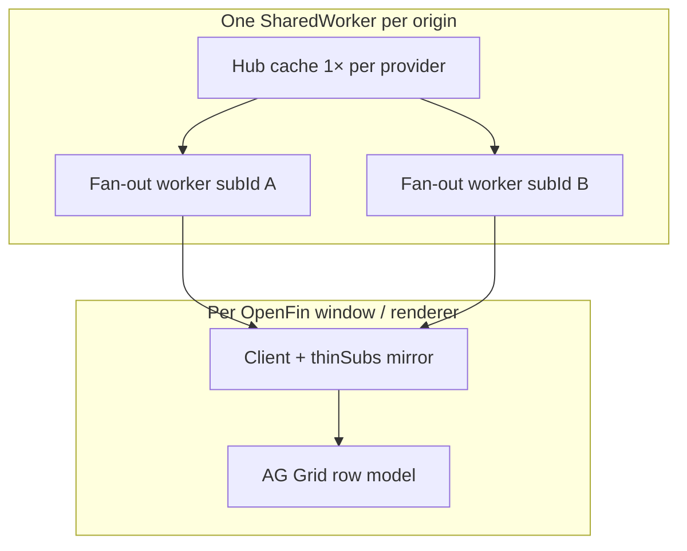

# Memory leak audit — MarketsGrid / host-data pipeline

Proactive audit of the streaming blotter **data pipeline** (SharedWorker hub,
fan-out workers, client adapters). For the **full MarketsGrid stack** (AG Grid,
engine modules, container wiring), see
[`MARKETSGRID_PERF_AND_MEMORY_AUDIT.md`](./MARKETSGRID_PERF_AND_MEMORY_AUDIT.md).

_Last reviewed: 2026-06-17._

---

## Executive summary

| Area | Verdict |
|------|---------|
| **Fan-out worker lifecycle** | Sound — one worker per `subId`, terminated on detach / port close / pool dispose |
| **Hub subscriber maps** | Sound — detach, port close, stale sweep, and dead-port prune all remove listeners |
| **Client heartbeats** | Sound — `stopHeartbeat` on unsubscribe; `close()` detaches all subs |
| **Provider idle teardown** | Sound — upstream stops when last data + stats subscriber leaves; cache cleared |
| **Intentional retention** | Per-window AG Grid + thin-delta row mirrors scale with row count (not leaks) |
| **Gaps found** | One fix applied (inline port listeners); monitoring playbook below |

No unbounded growth paths were found in the hot path after the 2026-06-16
hardening. Remaining risk is **operational** (many long-lived windows,
20k-row feeds) — measure with heap churn tests, not code inspection alone.

---

## Architecture — what memory is supposed to look like



**By design (not leaks):**

| Retained object | Scales with | Released when |
|-----------------|-------------|---------------|
| Hub provider cache | Row count × row width | Provider idle-stops (no subscribers) |
| `replaySnapshot` encoded chunks | Cache generation | O(1) invalidation on cache mutation |
| `thinSubs` row `Map` | Visible row keys | `unsubscribe`, `sub-init`, client `close()` |
| Fan-out worker | Active `subId` | `detach`, `onPortClosed`, eviction |
| AG Grid nodes | Displayed rows | Component unmount |

---

## Component audit

### `FanOutWorkerPool`

| Check | Status |
|-------|--------|
| Worker `terminate()` on `unregisterSubscriber` | ✅ |
| `pendingConnections` listeners removed on `unregisterClient` | ✅ |
| `pendingJobs` cleared on timeout / `broadcast-done` / `dispose` | ✅ |
| Shared `onWorkerMessage` removed per worker on destroy | ✅ |

Regression: `memoryLifecycle.test.ts` — 25 attach/detach cycles terminate all workers.

### `SharedWorkerDataServicesHub`

| Check | Status |
|-------|--------|
| `dataListeners` / `statsListeners` pruned on detach | ✅ |
| `onPortClosed` drops all subs for port + idle-stops providers | ✅ |
| `evictStaleSubscriber` releases fan-out worker | ✅ |
| `pruneDeadDataListeners` on `postMessage` throw | ✅ |
| `subscriberSweepTimer` stopped when no subs | ✅ |
| `statsSampler` stopped when no stats subs | ✅ |
| `replaySnapshot` invalidated on cache mutation (not duplicated) | ✅ |

### `SharedWorkerDataServicesClient`

| Check | Status |
|-------|--------|
| `pagehide` / `visibilitychange` removed on `close()` | ✅ |
| `detach` + `close()` send hub `detach` for every sub | ✅ |
| `thinSubs` deleted on `unsubscribe` / `close()` | ✅ |
| `startHeartbeat` replaces prior timer (no duplicate intervals) | ✅ |
| `subscription-lost` re-attach reuses same `subId` (no duplicate subs map entries) | ✅ |

### `ProviderClientAdapter` / `useDataProvider`

| Check | Status |
|-------|--------|
| `stop()` → `unsubscribe()` on hub handle | ✅ |
| Handler `Set`s cleared on `stop()` (not `restart()` detach) | ✅ (2026-06-17) |
| `useDataProvider` effect cleanup calls `provider.stop()` | ✅ |

### `useProviderDataWiring` / `HostedMarketsGrid`

| Check | Status |
|-------|--------|
| `visibilitychange` removed on effect cleanup | ✅ |
| Provider event unsubscribes on cleanup | ✅ |
| `beforeunload` / `pagehide` / OpenFin `destroyed` removed on unmount | ✅ |
| Provider `stop()` on wiring cleanup | ⚠️ Owned by `useDataProvider` lifecycle (container uses `autoStart: false` but separate stop effect) |

### Inline fan-out path (`STARUI_FANOUT_POOL_SIZE=0`)

| Check | Status |
|-------|--------|
| Raw `MessagePort` listeners removed on disconnect | ✅ Fixed 2026-06-17 — `PortLike.dispose()` called from `onPortClosed` |

---

## Risk register (ranked)

| # | Risk | Severity | Mitigation |
|---|------|----------|------------|
| 1 | **N windows × 20k rows** — per-renderer AG Grid + decode dominates heap | Expected | `projectFields`, throttle/conflate, visibility pause; production-build soak |
| 2 | **thinSubs mirror** holds full row objects per key when `thinDeltas: true` | Low–Med | Bounded by row count; cleared on detach |
| 3 | **subscription-lost ↔ eviction churn** in hidden windows | Low | Extended hidden ping grace (180s); re-attach is in-place |
| 4 | **Stats-only subscribers** keep provider alive without data subs | Low | By design (diagnostics pane); document for ops |
| 5 | **Dev-mode StrictMode** double-mount | N/A (dev only) | Judge leaks in production build |

---

## Monitoring playbook

### 1. Automated regression (CI)

```bash
npm test --workspace=@starui/host-data -- src/runtime/memoryLifecycle.test.ts
```

Also run full `npm test --workspace=@starui/host-data` after hub/client changes.

### 2. Manual Chrome heap churn (OpenFin or browser)

1. Open DevTools → **Memory** → take **Heap snapshot** (baseline).
2. Open 5 blotters, wait for STOMP steady state.
3. Close 4 blotters, force GC (DevTools trash icon), take snapshot.
4. Repeat open/close cycle **10×**.
5. Compare retained `Detached *`, `(closure)`, `system / Context`, and
   `Worker` / `MessagePort` counts vs baseline.

**Pass:** retained count stabilizes after cycles (no monotonic climb).

### 3. memlab (optional, recommended for CI artifact)

Per the memory-leak skill: capture baseline / target / revert heapsnapshots
after 10× open-close, then:

```bash
npx memlab run --scenario ./scripts/memlab/blotter-churn.js
```

(Script not yet checked in — add when automating OpenFin churn.)

### 4. Hub introspect (runtime)

Provider editor → **Diagnostics** tab, or `hub-introspect` RPC:

- `subscriberCount` should match open blotters.
- After closing all blotters for a provider, provider should go **idle**
  (no slot) unless a stats/diagnostics subscriber remains.

### 5. Fan-out worker count

With fan-out enabled (default), worker count ≈ **active data `subId`s**.
After closing all windows, SharedWorker thread should show **zero**
fan-out workers (terminated on last detach).

Disable check: `localStorage.STARUI_FANOUT_POOL_SIZE = '0'` — falls back
to inline hub fan-out (no extra workers).

---

## Fixes applied in this audit

| Fix | File |
|-----|------|
| `PortLike.dispose()` — remove raw port listeners on `onPortClosed` | `hubTypes.ts`, `entry.ts`, `SharedWorkerDataServicesHub.ts` |
| Clear handler `Set`s on `ProviderClientAdapter.stop()` | `ProviderClientAdapter.ts` |
| Lifecycle regression tests | `memoryLifecycle.test.ts` |

---

## Recommended follow-ups

1. **E2e / Playwright heap** — open 3 blotters, close, assert hub subscriber
   count via diagnostics API (when exposed in test harness).
2. **memlab scenario script** under `scripts/memlab/` for repeatable churn.
3. **OpenFin multi-window soak** — 10 blotters, 30 min STOMP, record
   renderer process memory in Task Manager / `fin.System.getProcessInfo`.
4. **Document stats subscriber** — diagnostics pane intentionally keeps
   stats subs alive; clarify in ops runbook.

---

## Related docs

- [`MARKETSGRID_V2_STRATEGY.md`](./MARKETSGRID_V2_STRATEGY.md) — strangler rewrite plan
- [`hub-fanout-optimizations.md`](./hub-fanout-optimizations.md) — fan-out architecture
- [`blotter-performance-roadmap.md`](./blotter-performance-roadmap.md) — per-window CPU/memory levers
- [`CHANGELOG-2026-06-16.md`](./CHANGELOG-2026-06-16.md) — recent lifecycle fixes
