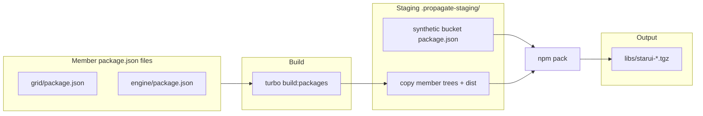

# `package.json` layout and packaging

How **`package.json` files** are organized in the MarketsUI monorepo, which
ones npm uses for **dev/build**, and which one drives **`npm pack`** tarballs
for external consumers.

**Related docs:**

| Document | Role |
|----------|------|
| [`PACKAGE_ORGANIZATION.md`](./PACKAGE_ORGANIZATION.md) | Ten architecture buckets and import rules |
| [`ARCHITECTURE.md`](./ARCHITECTURE.md) | Layer model |
| [`README.md`](../README.md) | `propagate`, `bootstrap`, consumer pipeline |
| [`scripts/propagate.mjs`](../scripts/propagate.mjs) | Tarball staging + pack implementation |

---

## 1. Executive summary

| Question | Answer |
|----------|--------|
| Why multiple `package.json` files under `packages/`? | One per **library member** — buckets are folders, not npm packages |
| Which `package.json` does **Turbo / `tsc` build** use? | Each **member** file (e.g. `packages/react-grid/grid/package.json`) |
| Which `package.json` does **`npm pack`** use? | A **synthetic bucket manifest** generated at pack time in `.propagate-staging/` |
| Does the repo root `package.json` get packed? | **No** — workspace orchestration only |
| Do in-repo demo apps install from tarballs? | **No** — Vite/tsc resolve `@starui/*` from `packages/` **source** |
| Who uses `libs/*.tgz`? | **External** sites (e.g. corporate Artifactory) via `file:` or registry pins |

---

## 2. Two levels: bucket vs member

The repo uses **ten architecture buckets** under `packages/` (see
[`PACKAGE_ORGANIZATION.md`](./PACKAGE_ORGANIZATION.md)). A bucket is a
**filesystem grouping** for related libraries. It does **not** have its own
`package.json` at the bucket root.

```text
packages/                          ← ten buckets (organizational)
├── react-core/                    ← NO package.json here
│   ├── app/package.json           ← @starui/app
│   ├── widgets-react/package.json ← @starui/widgets-react
│   ├── widget-sdk/package.json    ← @starui/widget-sdk
│   └── …
├── shared/
│   ├── engine/package.json        ← @starui/engine
│   └── host/package.json          ← @starui/host
├── react-grid/
│   └── grid/package.json          ← @starui/grid
└── …
```

| Level | Example path | Has `package.json`? | npm package name |
|-------|--------------|---------------------|------------------|
| **Bucket** | `packages/react-core/` | No | — |
| **Member** | `packages/react-core/widgets-react/` | Yes | `@starui/widgets-react` |

**Multiple `package.json` files inside one bucket folder = multiple independent
libraries in that bucket.** That is intentional, not duplication.

### Member inventory (consumer pipeline)

Buckets and members included in root workspaces and `propagate` (Angular
buckets excluded from build — see §7):

| Bucket | Members (`package.json` path) | Packed as |
|--------|------------------------------|-----------|
| `design-system/` | `design-system/`, `icons-svg/` | `@starui/design-system` |
| `react-ui/` | `ui/` | `@starui/react-ui` |
| `react-grid/` | `grid/` | `@starui/react-grid` |
| `data/` | `host-config/`, `host-data/`, `host-data-react/` | `@starui/data` |
| `openfin/` | `host-openfin/`, `openfin-platform/` | `@starui/openfin` |
| `react-core/` | `app/`, `widgets-react/`, `widget-sdk/`, `host-wrapper-react/`, `config-browser/`, `workspace-setup-react/` | `@starui/react-core` |
| `shared/` | `types/`, `shared-types/`, `engine/`, `host/`, `host-browser/`, `widget/`, `widget-browser/` | `@starui/shared` |

Public import names stay stable (`@starui/grid`, not `@starui/react-grid/grid`).
Only filesystem paths follow buckets.

---

## 3. Workspace roots (three tiers)

### 3.1 Root `package.json` (`marketsui-platform`)

- **Role:** Monorepo workspace root, Turbo scripts, shared devDependencies.
- **Workspaces:** Explicit globs listing each consumer bucket/member (npm 10
  does not support arbitrary `packages/**` — see root `"//workspaces-note"`).
- **Not packed** as a publishable library.

```json
"workspaces": [
  "packages/design-system/*",
  "packages/react-ui/*",
  "packages/react-grid/*",
  "packages/data/host-config",
  "packages/data/host-data",
  "packages/data/host-data-react",
  "packages/openfin/*",
  "packages/react-core/*",
  "packages/shared/*",
  "tools/mcp-scaffold",
  "e2e-openfin"
]
```

### 3.2 Member `package.json` (under `packages/<bucket>/<member>/`)

Each file defines one workspace package:

| Field | Used for |
|-------|----------|
| `name` | `@starui/<member-name>` (e.g. `@starui/grid`) |
| `version` | Member version; bucket pack version = max across members |
| `scripts.build` | `rimraf dist && tsc` (Turbo `build` task) |
| `exports` | Public API subpaths; **merged** into bucket tarball (§5) |
| `dependencies` / `devDependencies` | Workspace `"*"` links to other members |

**This is the manifest npm workspaces and Turbo use for day-to-day development.**

### 3.3 `apps/package.json` + per-demo `package.json`

- **Role:** Nested workspace for demo/reference apps (`star-demo`, `demo-react`, …).
- **Not used** for library packaging.
- Apps declare **no** `@starui/*` deps; they resolve libraries from repo-root
  symlinks + Vite aliases (`scripts/staruiConsumerAliases.mjs`).

---

## 4. Dev and build: member `package.json`

### Install

```bash
npm install          # root — links all workspace members
npm run install:apps # apps/ nested workspace (third-party deps only)
```

Workspace linking creates `node_modules/@starui/<name>` → `packages/...`.

### Build

```bash
npm run build:packages   # ensure-workspace-links + turbo build
```

Turbo runs each member's `scripts.build` from **that member's `package.json`**,
in dependency order. Outputs land in `packages/<bucket>/<member>/dist/`.

### Typecheck / test

Same pattern — filters in root `package.json` target workspace packages, not
bucket folders.

### In-repo apps (source mode)

Demo apps import `@starui/grid`, `@starui/widgets-react`, etc. straight from
**TypeScript source** under `packages/`. Changing a member does **not** require
`npm run propagate` for apps to see the change — only rebuild/reload.

---

## 5. Packaging: synthetic bucket `package.json`

External consumers (behind corporate Artifactory, or any project **not** in this
monorepo) install **bucket tarballs** from `libs/`:

```text
libs/starui-react-core.tgz
libs/starui-shared.tgz
libs/starui-react-grid.tgz
…
libs/manifest.json    ← bucket → filename, members, sha
```

Those tarballs are produced by **`npm run propagate`** (`scripts/propagate.mjs`).

### 5.1 Pipeline overview



### 5.2 Step-by-step

1. **Discover buckets** — scan `packages/<bucket>/*/` for `package.json`.
2. **Build all members** — `npm run build:packages` (unless `--no-build`).
3. **Stage** — for each bucket:
   - Create `.propagate-staging/<bucket>/`
   - **Write synthetic `package.json`** (see below)
   - Copy each member directory into `staging/<bucket>/<member-folder>/`
     (includes each member's original `package.json` + `dist/`, excludes
     `node_modules`, `.turbo`, etc.)
4. **Pack** — `npm pack` with `cwd` = staging root → `libs/starui-<bucket>.tgz`
   (stable name; versioned mirror under `dist/packages/`).
5. **Manifest** — update `libs/manifest.json` with members list and content hash.

### 5.3 Synthetic bucket manifest

`writeBucketPackageJson()` in `propagate.mjs` generates the **only `package.json`
that `npm pack` reads at the tarball root**:

| Field | Source |
|-------|--------|
| `name` | `@starui/<bucket>` (e.g. `@starui/react-core`) |
| `version` | Highest `version` among members in that bucket |
| `private` | `true` |
| `exports` | **Merged** from every member's `exports` (and `main` fallback) |

Export merge rules (`buildBucketExports()`):

- If a member's npm `name` equals the bucket name (e.g. `@starui/react-grid`
  inside `react-grid` bucket with single member `@starui/grid`), its exports are
  **hoisted** to the bucket root (`"."`, `"./customizer"`, …).
- Otherwise, member exports are exposed under `./<short-name>/…` (e.g.
  `./widgets-react/hosted` → `./widgets-react/dist/hosted/index.js`).

Example: installing `@starui/react-core` from a tarball:

```ts
import { HostedMarketsGrid } from '@starui/react-core/widgets-react/hosted';
import { StarGridApp } from '@starui/react-core/app';
```

See `packages/angular-core/README.md` for the same subpath pattern on Angular
buckets (excluded from consumer build but same pack layout).

### 5.4 What ends up inside the `.tgz`

```text
package/                          ← npm pack root
├── package.json                  ← SYNTHETIC (@starui/react-core)
├── app/
│   ├── package.json              ← original member manifest (reference)
│   ├── dist/ …
│   └── src/ …                    ← copied unless filtered
├── widgets-react/
│   ├── package.json
│   └── dist/ …
└── …
```

Consumers resolve imports through the **bucket root `exports`**, not by
installing each member as a separate npm package.

### 5.5 Propagate commands

```bash
npm run propagate                    # all buckets: build + pack
npm run propagate -- react-core      # one bucket
npm run propagate -- @starui/grid    # resolves to containing bucket
npm run propagate -- --dry-run
npm run propagate -- --no-build      # pack only (dist must exist)
npm run check:tarballs               # fail if libs/ stale vs source
```

Full flag list: `node scripts/propagate.mjs --help` or [`README.md`](../README.md).

---

## 6. Quick reference: which file when?

| Task | `package.json` used |
|------|---------------------|
| `npm install` at repo root | Root workspaces list → **member** packages linked |
| `turbo build` / `npm test` | **Member** `scripts` + `name` |
| Add a dependency between libraries | **Member** `dependencies` with `"*"` |
| Publish API subpath (`exports`) | **Member** `exports` → merged at pack time |
| `npm run propagate` / `npm pack` | **Synthetic bucket** manifest in staging |
| External app `file:libs/starui-*.tgz` | Installs **`@starui/<bucket>`** at tarball root |
| `star-demo` / `demo-react` dev | **None of the above for install** — source aliases |
| Add a new library | Create **new member** `package.json` + add to root `workspaces` |

---

## 7. Angular and excluded members

These paths **have** member `package.json` files but are **excluded** from the
consumer pipeline (root workspaces, Turbo consumer build, `propagate`):

| Excluded | Reason |
|----------|--------|
| `packages/angular-ui/` | Angular bucket |
| `packages/angular-grid/` | Angular bucket |
| `packages/angular-core/` | Angular bucket |
| `packages/data/host-data-angular/` | Angular member in data bucket |

Source remains in the repo for future re-enable; re-add workspace globs per
[`CLAUDE.md`](../CLAUDE.md) to bring them back.

---

## 8. Common misconceptions

### “Why not one `package.json` per bucket?”

Separate members give:

- **Independent build graph** — Turbo caches and orders by dependency.
- **Import boundaries** — e.g. `@starui/engine` must not depend on `@starui/grid`.
- **Stable public names** — `@starui/grid` unchanged while paths moved to buckets.
- **Selective tarball subpaths** — bucket pack exposes members without publishing
  dozens of separate npm packages to Artifactory.

### “Is the bucket folder’s `package.json` missing?”

Correct — there is **no** `packages/react-core/package.json` by design.

### “I see `node_modules` under a member — is that another package?”

e.g. `packages/data/host-data/node_modules/@types/node/package.json` is a
**local install artifact**, not a workspace member. Members should hoist to the
repo root; nested `node_modules` under `packages/` should not be committed.

### “Do I need `propagate` after every code change?”

| Consumer | Need propagate? |
|----------|-----------------|
| In-repo demo apps (`npm run dev:star-demo`) | **No** — source aliases |
| `npm run build:apps` / `typecheck:apps` | **No** — source + workspace symlinks |
| External app using `libs/*.tgz` | **Yes** — after package changes |
| `npm run verify:consumer` / CI consumer parity | **Yes** — full pipeline |

---

## 9. Adding a new library (checklist)

1. Pick architecture bucket ([`PACKAGE_ORGANIZATION.md`](./PACKAGE_ORGANIZATION.md)).
2. Create `packages/<bucket>/<member>/` with **member** `package.json`
   (`name`, `version`, `exports`, `scripts.build`, deps).
3. Add workspace glob to **root** `package.json` if not covered by existing `*`.
4. Run `npm install` at root.
5. Update [`docs/current-features.md`](./current-features.md).
6. For external consumers: `npm run propagate` and verify `libs/manifest.json`.

---

## 10. Document history

| Date | Change |
|------|--------|
| 2026-06-17 | Initial doc — bucket vs member, dev/build vs propagate packaging |
