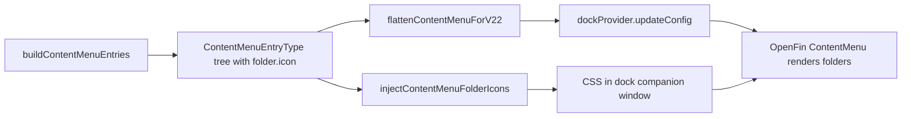

# Dock content menu: folder row icons

How MarketsUI adds leading icons to **top-level** Dock3 content-menu folders (SPG, Color palette, Tools, and user-defined dropdowns) when OpenFin’s built-in `ContentMenu` only renders icons on `type: "item"` rows.

**Package:** `@starui/openfin-platform`  
**Primary files:** `packages/openfin/openfin-platform/src/dock.ts`, `packages/openfin/openfin-platform/src/dockConfigTypes.ts`

---

## Problem

The Dock3 content menu is a two-column control:

| Column | Typical rows | Native OpenFin icons |
|--------|----------------|----------------------|
| Left (root) | SPG, Color palette, Tools | **No** — folders show label + chevron only |
| Right (submenu) | Workspace Setup, Data Providers, … | **Yes** — each `type: "item"` has `icon` |

Submenu items already used `contentMenuIcon()` with theme-aware SVG data URLs. Root folders did not, because the platform API and UI library omit folder icons.

---

## OpenFin platform constraint

Workspace **23.x** defines `ContentMenuEntry` (re-exported from `@openfin/ui-library`) as:

- **`type: "item"`** — `id`, `label`, `icon`, `itemData`
- **`type: "folder"`** — `id`, `label`, `children` only (no `icon` in the published type)

In `@openfin/ui-library`’s `ContentMenuItem`, the leading `IconWithFallback` is rendered only when `entry.type === "item"`. Folder rows get `ChevronRightIcon` on the right, not a left icon.

References:

- [Dock3Config](https://developer.openfin.co/workspace/docs/platform/latest/interfaces/Dock3Config.html) — `contentMenu?: ContentMenuEntry[]`
- OpenFin starter sample: [dock-entries.ts](https://github.com/built-on-openfin/workspace-starter/blob/main/how-to/register-with-dock3-basic/client/src/dock-entries.ts) (folders without icons)

We cannot fix this with Dock3 config alone. The implementation works around the UI gap while still building a correct menu tree for navigation.

---

## Approach (two layers)



1. **Data layer** — Attach optional `icon` on every `ContentMenuFolderEntry` in our types and builders (same `{ dark, light }` or string shape as items).
2. **Presentation layer** — After each config push, inject a `<style>` block into the **dock companion window** so folder rows use `#content-menu-item-<folder-id>` with a `background-image` from the active theme’s icon URL.

When OpenFin adds native folder icons, we can drop the CSS injection and keep the data model.

---

## Data model

`ContentMenuFolderEntry` in `dockConfigTypes.ts` includes optional `icon`:

```ts
export interface ContentMenuFolderEntry {
  type: "folder";
  id: string;
  label: string;
  icon?: DockEntryIcon; // string | { dark: string; light: string }
  children: ContentMenuEntryType[];
  bookmarked?: boolean;
}
```

`DockEntryIcon` is shared with Dock3 favorites entries.

---

## Where icons are assigned

| Menu row | Source | Icon |
|----------|--------|------|
| **Color palette** | `buildPaletteContentMenuFolder()` in `dock.ts` | Inline Lucide-style palette SVG → `contentMenuIcon(PALETTE_SVG)` |
| **Tools** | `toolsFolder` in `buildContentMenuEntries()` | `contentMenuIcon(TOOLS_SVG)` (`wrench` from `allIcons.ts`) |
| **SPG / user dropdowns** | `toDock3UserContentMenu()` in `dockConfigTypes.ts` | `makeDualIcon()` from each `DropdownButton`’s `iconId` / `iconUrl` / `iconColor` |
| **Nested submenu folders** | `menuItemToContentMenuEntry()` | Same `makeDualIcon()` as leaf items when `options[]` is non-empty |

`contentMenuIcon(svg)` returns `{ dark, light }` data URLs:

- Dark theme: stroke `#ffffff`
- Light theme: stroke `#1a1a2e`

Same helpers as Tools submenu items (`SETTINGS_SVG`, `REFRESH_SVG`, etc.).

---

## Menu assembly

`buildContentMenuEntries(editorConfig?)` returns:

```text
[ ...userMenus from DockEditorConfig, paletteFolder, toolsFolder ]
```

Order: user dropdown folders first (e.g. SPG), then system **Color palette**, then **Tools**.

`flattenContentMenuForV22()` still coerces icons to a single string per active theme for items. For folders it passes `icon` through when present (extra field; safe for current runtime, useful if the platform starts reading it).

---

## CSS injection

### Functions (`dock.ts`)

| Function | Role |
|----------|------|
| `collectContentMenuFolders(entries)` | Walks the tree; collects `{ id, icon }` for every folder with an `icon` |
| `injectContentMenuFolderIcons(entries, theme)` | Builds CSS and runs it in the dock window via `executeJavaScript` |
| `pickIconVariant(icon, theme)` | Resolves `{ dark, light }` → one data URL for the active theme |

### DOM target

OpenFin’s `ContentMenuItem` sets `id="content-menu-item-${entry.id}"` on the row container. Injected rule (per folder):

```css
#content-menu-item-<id> {
  background-image: url(<data-url>);
  background-repeat: no-repeat;
  background-position: 10px center;
  background-size: 16px 16px;
  padding-left: 34px !important;
}
```

Styles are stored in `<style id="starui-content-menu-folder-icons">` in the companion document `head`. Each injection replaces `textContent` so theme toggles and config reloads stay in sync.

### When injection runs

| Trigger | Call site |
|---------|-----------|
| Initial `Dock.init()` | End of `registerDock()` after provider is created |
| Config / theme refresh | `applyDock3Config()` after `updateConfig()` |
| Dock companion `loadConfig` override | After rebuilding menu from IndexedDB |

Injection is best-effort: failures log `[Dock3] Could not inject content-menu folder icons` and do not break the dock.

---

## Theme changes

`recolorDockIcons()` → `applyDock3Config()` rebuilds menu entries and re-injects CSS with `readDockTheme()` (`data-theme` on `<html>`, then `localStorage` `theme`). Folder icons switch dark/light variants with submenu items.

---

## Extending

### New system folder

1. Add or reuse an SVG in `packages/openfin/openfin-platform/src/icons/allIcons.ts`.
2. In `buildContentMenuEntries()` (or a dedicated builder), set `type: "folder"`, stable `id`, `label`, `icon: contentMenuIcon(...)`, and `children`.
3. No CSS changes needed if `id` is unique — injection is driven off the tree walk.

### User-facing dropdown (dock editor)

Icons come from the saved `DockEditorConfig` dropdown button (`iconId` / `iconUrl` / `iconColor`). Re-save in Workspace Setup / dock editor and reload dock if the companion window was opened before the config existed.

---

## Troubleshooting

| Symptom | What to try |
|---------|-------------|
| Root folders still have no icon | **Reload Dock** (Tools submenu) to recreate the companion window and re-run injection |
| Wrong icon after theme toggle | Confirm `applyDock3Config` ran (theme toggle path in `launchEntry` calls it) |
| SPG row has no icon | Ensure the dropdown has `iconId` or `iconUrl` in saved dock config |
| Misaligned icon vs label | Adjust `background-position` / `padding-left` in `injectContentMenuFolderIcons()` |

---

## Related code (quick map)

```text
packages/openfin/openfin-platform/src/
  dock.ts
    buildPaletteContentMenuFolder()   # palette folder + icon
    buildContentMenuEntries()         # full menu + tools folder icon
    flattenContentMenuForV22()        # theme flatten + folder icon passthrough
    injectContentMenuFolderIcons()    # companion CSS
    applyDock3Config()                # updateConfig + inject
  dockConfigTypes.ts
    ContentMenuFolderEntry            # icon?: DockEntryIcon
    toDock3UserContentMenu()          # SPG / dropdown folders
    menuItemToContentMenuEntry()      # nested folders
  icons/allIcons.ts
    TOOLS_SVG, SETTINGS_SVG, …        # system SVG sources
```

---

## Future cleanup

If `@openfin/ui-library` adds `icon` to the folder variant of `ContentMenuEntry` and renders it in `ContentMenuItem`:

1. Remove `injectContentMenuFolderIcons()` and the companion `<style>` injection.
2. Keep `ContentMenuFolderEntry.icon` and the builders — they already match the intended API shape.
3. Optionally simplify `flattenContentMenuForV22` comments (no longer a “v22 folder has no icon” workaround for display).

Until then, the CSS injection is the supported way to get visual parity between root folders and submenu items.
