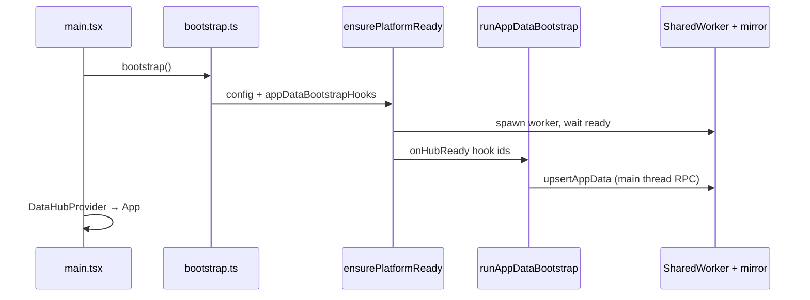
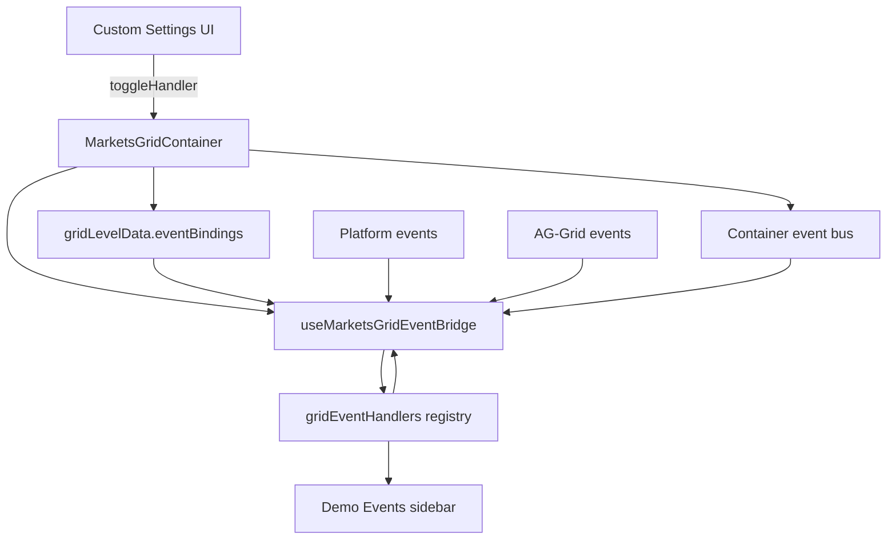

# Platform hooks demo — testing guide

Hands-on documentation for the **`apps/demos/platform-hooks-demo`** app. Use it to validate **AppData bootstrap** and **MarketsGrid event callbacks** without a STOMP broker.

**Run:**

```bash
npm run dev:platform-hooks-demo
# http://localhost:5214
```

**Related:**

- App README: [`../../apps/demos/platform-hooks-demo/README.md`](../../apps/demos/platform-hooks-demo/README.md)
- Bootstrap config reference: [platform-bootstrap-config.md](./platform-bootstrap-config.md)
- Minimal STOMP sample (subset of hooks): [`../../apps/demos/stomp-marketsgrid-minimal/`](../../apps/demos/stomp-marketsgrid-minimal/)

---

## Overview

Two independent hook systems:

| System | Config location | Code location | When it runs |
|--------|-----------------|---------------|--------------|
| **AppData bootstrap** | `app-config.json` → `appDataBootstrap` | `src/platform/appDataBootstrap.ts` | Once per hub ready (main thread) |
| **Grid event callbacks** | `gridLevelData.eventBindings` | `src/platform/gridEventHandlers.ts` | On each subscribed grid/platform/provider event |

Neither system stores executable code in JSON — only **stable string ids**.

---

## Part 1 — AppData bootstrap

### 1.1 Boot sequence



### 1.2 Manifest fields

From `apps/demos/platform-hooks-demo/public/app-config.json`:

```json
{
  "appDataBootstrap": {
    "onHubReady": ["session-context", "desk-defaults"],
    "runPolicy": "if-missing",
    "targets": {
      "session-context": ["SessionContext"],
      "desk-defaults": ["DeskDefaults", "positions"]
    }
  }
}
```

| Field | Meaning |
|-------|---------|
| `onHubReady` | Hook ids to run after hub + AppData mirror ready |
| `onUserChange` | *(optional)* Hook ids when session user changes |
| `runPolicy` | `if-missing` (default), `always`, or `once-per-session` |
| `targets` | Per-hook AppData provider names; used by `if-missing` skip logic |

### 1.3 Hook implementations

**`session-context`** seeds entitlements and login metadata:

```typescript
'session-context': async (ctx) => {
  await ctx.upsertAppData({
    name: 'SessionContext',
    values: {
      userId: ctx.userId,
      entitlements: ['desk-a', 'desk-b', 'risk-read'],
      loginAt: new Date().toISOString(),
    },
  });
},
```

**`desk-defaults`** seeds desk config and `positions.asOfDate` (for historical toolbar):

```typescript
'desk-defaults': async (ctx) => {
  await ctx.upsertAppData({ name: 'DeskDefaults', values: { … } });
  await ctx.upsertAppData({ name: 'positions', values: { asOfDate: today } });
},
```

### 1.4 Test checklist — AppData bootstrap

| Step | Action | Expected result |
|------|--------|-----------------|
| A1 | Start app, open **AppData** tab | `SessionContext`, `DeskDefaults`, `positions` visible |
| A2 | Reload page | Same data; console may show hooks skipped (if-missing) |
| A3 | Clear AppData in hub inspector or IndexedDB, reload | Hooks run again; `[bootstrap]` console logs |
| A4 | Press **Alt+Shift+S** | Inspector shows AppData providers matching sidebar |
| A5 | Change `runPolicy` to `always` in app-config (local experiment) | Hooks run on every reload |

### 1.5 Policy behavior

| Policy | When hook runs |
|--------|----------------|
| `if-missing` | Skip if **all** `targets[hookId]` providers exist with at least one key |
| `always` | Every `onHubReady` trigger |
| `once-per-session` | At most once per tab; gated by `sessionStorage` key `starui:appDataBootstrap:${appId}:${userId}:${hookId}` |

---

## Part 2 — Grid event callbacks

### 2.1 Data flow



Each catalog event maps to **at most one** handler. Custom Settings uses a shadcn `Select` per event (same pattern as the provider dropdowns above).

### 2.2 Bindable events (catalog)

From `@wellsfargo-starui/grid` → `MARKETS_GRID_EVENT_CATALOG`:

**Platform**

| Event id | Trigger |
|----------|---------|
| `grid:ready` | Grid + profile pipeline ready |
| `grid:destroyed` | Grid tearing down |
| `profile:loaded` | Profile applied |
| `profile:saved` | User saved active profile |
| `profile:deleted` | Profile removed |

**Provider** (emitted by `MarketsGridContainer`)

| Event id | Trigger |
|----------|---------|
| `provider:status` | Stream status change (`loading` / `ready` / `error`) |
| `provider:switched` | Live/historical id or mode change |
| `provider:dataStale` | Stale banner on/off |
| `toolbar:dateChanged` | Toolbar as-of date picker |

**Grid** (AG-Grid via platform API hub)

| Event id | Trigger |
|----------|---------|
| `grid:firstDataRendered` | First row render |
| `grid:rowDataUpdated` | Row model update |
| `grid:cellClicked` | Cell click |
| `grid:cellValueChanged` | Cell edit commit |
| `grid:filterChanged` | Filter model change |

### 2.3 Handler registry

Handlers live in **`src/platform/gridEventHandlers.ts`**. Each receives `(payload, ctx)` where `ctx` includes:

- `gridId`, `instanceId`, `appId`, `userId`
- `handle` — `MarketsGridHandle` (profiles, platform events, grid API)
- `appData` — sync read for template resolution

Demo handlers append to the sidebar log via `appendDemoEventLog()`.

### 2.4 Custom Settings UI

1. Grid toolbar → **settings** (gear) opens the customizer drawer (defaults to **Grid Options**).
2. Use the **module dropdown** → **Custom Settings**.
3. Scroll to **EVENT CALLBACKS**.
4. For each event, pick **one** callback from the dropdown (or **— None —**).
5. Bindings save automatically to **`gridLevelData`** (same blob as provider selection + caption).

Handler labels come from **`handlerMeta`** prop on `MarketsGridContainer`:

```typescript
<MarketsGridContainer
  gridEventHandlers={gridEventHandlers}
  handlerMeta={gridHandlerMeta}
  …
/>
```

### 2.5 Test checklist — grid events

| Step | Bind | Action | Expected |
|------|------|--------|----------|
| G1 | `log-profile-saved` → Profile saved | Toolbar **Save** | Events tab: profile id |
| G2 | `log-profile-loaded` → Profile loaded | Switch profile | Events tab: loaded profile |
| G3 | `log-provider-status` → Provider status | Wait for grid load | Status transitions logged |
| G4 | `log-provider-switched` → Provider switched | Change provider/mode in Custom Settings | Switch payload logged |
| G5 | `log-toolbar-date` → Toolbar date changed | Pick yesterday in toolbar date picker | Date + `historical=true` |
| G6 | `log-cell-clicked` → Cell clicked | Click any cell | Click logged |
| G7 | `log-filter-changed` → Filter changed | Apply column filter | Filter change logged |
| G8 | *(any binding)* | Reload page | Dropdown selections restored (grid-level persistence) |
| G9 | G1 binding | Switch profile | Binding still active (not profile-scoped) |

### 2.6 Suggested starter bindings

For a quick smoke test, enable:

- `profile:saved` → `log-profile-saved`
- `provider:status` → `log-provider-status`
- `toolbar:dateChanged` → `log-toolbar-date`

Then save a profile and change the toolbar date — three log lines confirm end-to-end wiring.

---

## Part 3 — Adopting in your app

### Minimum AppData bootstrap

1. Add `src/platform/appDataBootstrap.ts` exporting `appDataBootstrapHooks`.
2. Add `appDataBootstrap` block to `public/app-config.json`.
3. Pass hooks to `ensurePlatformReady(config, { appDataBootstrapHooks, workerScriptUrl })`.

### Minimum grid event callbacks

1. Add `src/platform/gridEventHandlers.ts` + optional `hooksMeta.ts`.
2. Pass to `MarketsGridContainer` or `HostedMarketsGrid`:

```typescript
<HostedMarketsGrid
  gridEventHandlers={gridEventHandlers}
  handlerMeta={gridHandlerMeta}
  …
/>
```

3. Users bind events in Custom Settings; bindings persist in `gridLevelData`.

### Copy from demo

| Copy from demo | Into your app |
|----------------|---------------|
| `platform/appDataBootstrap.ts` | Adapt hook ids + AppData shapes |
| `platform/gridEventHandlers.ts` | Replace log store with your side effects |
| `platform/hooksMeta.ts` | User-facing labels |
| `public/app-config.json` fragment | Match hook ids |

---

## Part 4 — Debugging

| Issue | Where to look |
|-------|---------------|
| Hook never runs | Hook id mismatch between JSON and registry; unknown ids warn + skip |
| Hook runs every reload | Expected with `runPolicy: always`; use `if-missing` + `targets` |
| Handler never fires | Binding not saved — check Custom Settings; handler id typo |
| Handler fires but no UI log | Handler throws — check console for `[@wellsfargo-starui/grid eventBridge]` warnings |
| Bindings lost | Wrong storage adapter; demo uses localStorage — production may use ConfigService |
| AppData empty | Bootstrap before `DataHubProvider`; hub worker failed — check console |

**Hub inspector (**Alt+Shift+S**):** live providers, AppData snapshot, subscriber counts, cfg JSON.

---

## API reference (library exports)

### `@wellsfargo-starui/host-data`

- `AppDataBootstrapManifest`, `AppDataBootstrapHookRegistry`
- `runAppDataBootstrap()`, `createAppDataBootstrapContext()`
- `ensurePlatformReady(..., { appDataBootstrapHooks })`

### `@wellsfargo-starui/grid`

- `MARKETS_GRID_EVENT_CATALOG`, `MarketsGridEventId`
- `MarketsGridEventHandlerRegistry`, `MarketsGridEventContext`
- `useMarketsGridEventBridge()`, `createMarketsGridContainerEventBus()`
- `GridEventBindingsHostApi`, `GridEventBindingsSection` (via customizer)

### `@wellsfargo-starui/widgets-react`

- `MarketsGridContainer` props: `gridEventHandlers`, `handlerMeta`
- `normalizeGridLevelData()` / `GridLevelStateV1` in markets-grid-container module

---

## Related — native cell flash colour

This demo focuses on **hooks and event bindings**, not live streaming. To try AG-Grid's native **flash-on-change** tint (separate from conditional-styling rule flashes):

1. Toolbar **settings** → stay on **Grid Options**.
2. **DEFAULT COLDEF → CELL CONTENT** → enable **FLASH ON CHANGE**.
3. Pick a **FLASH COLOR** swatch (maps to `--ag-value-change-value-highlight-background-color`).

For a streaming lab with both native flash and style-rule flashes, run `npm run dev:markets-grid-lab` → **Live Updates** tab. See [MarketsGrid usage guide §22](../../MARKETSGRID_USAGE_GUIDE.md#22-grid-customizer-ui-settings-drawer).

---

## Verification commands

```bash
# Unit tests for hook infrastructure
cd packages/data/host-data && npx vitest run src/bootstrap/appDataBootstrap.test.ts
cd packages/react-grid/grid && npx vitest run src/events/useMarketsGridEventBridge.test.ts
cd packages/react-core/widgets-react && npx vitest run src/v2/markets-grid-container/gridLevelState.test.ts

# Typecheck demo app (after npm ci links workspace)
npm run typecheck --workspace=@wellsfargo-starui/platform-hooks-demo
```
