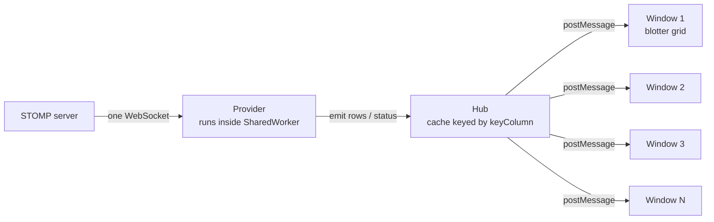
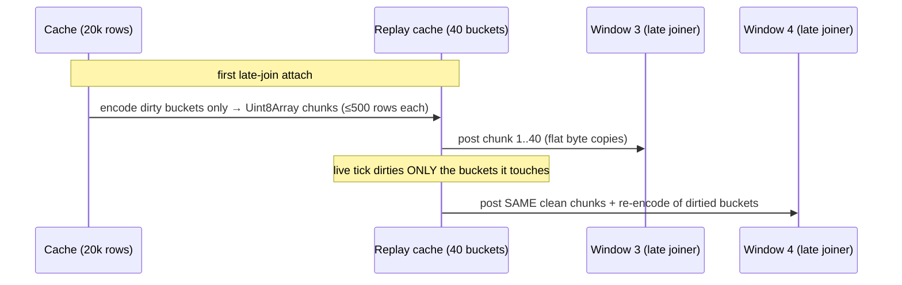
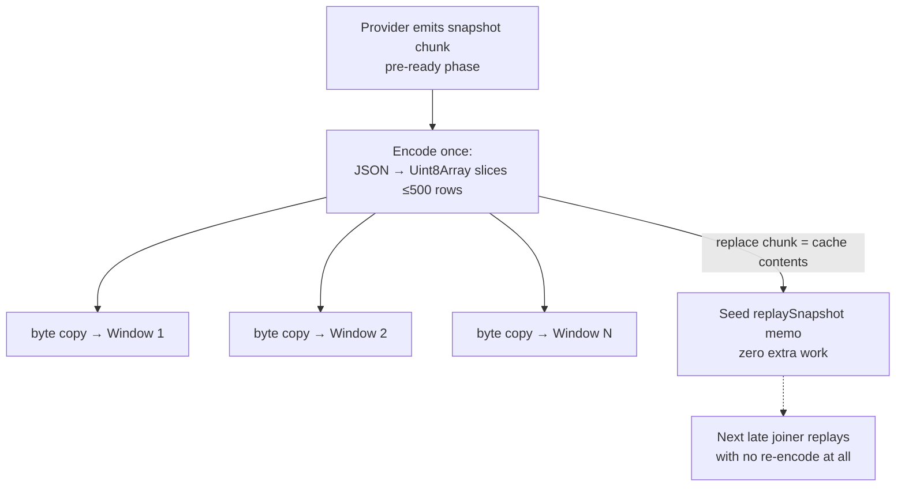
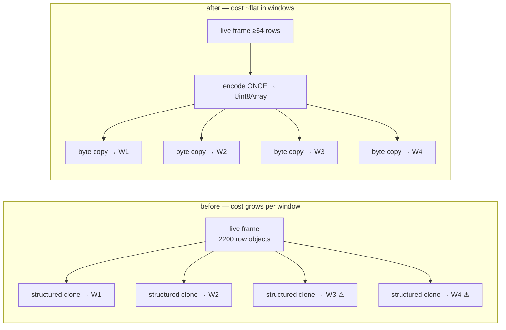
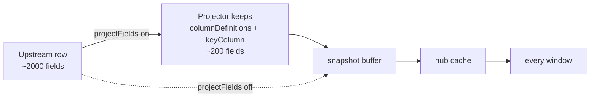
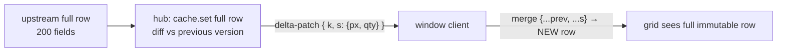

# SharedWorker Hub — High-Volume Fan-Out Optimizations

How the `@starui/host-data` SharedWorker hub publishes large snapshots
and high-rate realtime streams to many subscriber windows, what was
optimized, and the architectural trade-offs behind each choice.

Every section is explained twice: **technical** (left) and **in plain
words** (right).

---

## 1. The starting architecture

| Technical | In plain words |
|---|---|
| All windows of the app share one `SharedWorker`. Each data provider runs **once** inside it, holds one upstream connection, and maintains one row cache (`Map<key, row>`). Windows attach over `MessagePort`s; the hub fans every event out with `postMessage`, which **structured-clones** the payload per port. | Instead of every window dialing the server itself, there is one shared "post office" that downloads the data once and hands a copy to each open window. The catch: *making each copy* is work, and the post office is a single worker — if copying gets expensive, everyone queues. |

**Why this architecture at all:** N windows cost one upstream
connection and one cache. The server never knows how many windows are
open. The price is that the worker thread is a single lane — every
optimization below exists to keep that lane clear.

---

## 2. The two traffic shapes

| Technical | In plain words |
|---|---|
| **Snapshot traffic**: 20,000+ rows delivered once at start/restart, and replayed to every *late-joining* window from the cache. Bursty, large, latency-sensitive (a window is visibly blank until done). | The "load everything" moment — when a blotter opens or you hit Restart, it needs all 20,000 rows before it can show anything. |
| **Realtime traffic**: continuous delta frames (in stress profile ~9 frames/sec × ~2,200 rows = ~20,000 row-updates/sec) that must reach **every** window forever. Steady, unbounded, throughput-sensitive. | The "ticking prices" stream — a firehose that never stops, and every open window drinks the whole thing. |

These two shapes fail differently, so they got different fixes.

---

## 3. Optimization P1/P2 — memoized, pre-encoded snapshot replay

| Technical | In plain words |
|---|---|
| Late-join replay used to structured-clone the whole cache per attaching window. Now the hub keeps a **bucketed replay cache** (`replayCache.ts`): the cache is bucketed by insertion order into ≤ `LATE_JOIN_CHUNK_SIZE` (500)-row groups, each with its own pre-encoded `Uint8Array` chunk. Every attach posts the *same buffers* for clean buckets — cloning a `Uint8Array` over `postMessage` is a flat `memcpy`, not an object-graph walk. A live tick nulls only the chunks of the buckets it touches; replay re-encodes just those. (The original design memoized one flat chunk array and invalidated it wholesale on ANY mutation — with live ticks flowing, every attach re-encoded the entire cache, which is what made opening several blotters against a ticking feed serialize N full-cache encodes on the hub thread.) | Instead of re-photocopying a 20,000-page book for every new reader, the post office prints it once as thin booklets and hands out cheap reprints — and when a price ticks, only the affected booklets are reprinted, not the whole book. The old scheme threw away the entire print master on every tick, so during live trading every new reader forced a full reprint. |
| **Why chunks of 500:** each port message decodes on the receiving window's main thread; 500 rows keeps each decode under Chromium's 50 ms long-task threshold, so the UI never visibly freezes during load. | The book is shipped as thin booklets instead of one heavy box, so the reader can keep flipping pages (the UI keeps responding) while it arrives. |
| **Why UTF-8 JSON bytes and not `ArrayBuffer` transfer:** a transferred buffer is *moved*, not copied — unusable for the second subscriber. Shared chunks must survive N posts, so they're cloned; cloning bytes is the cheap kind of clone. | Handing over the original means the next reader gets nothing. Cheap reprints beat donating the master copy. |

---

## 4. Optimization P3/P4 — allocation discipline on the hot tick path

| Technical | In plain words |
|---|---|
| **P3 — event object reuse:** `broadcastData` reuses ONE event object across the listener loop, rewriting `subId` per listener before each `postMessage` (safe: `postMessage` serializes synchronously). Removes a per-listener-per-tick allocation. | Reuse one envelope and re-address it for each recipient, instead of making a fresh envelope per letter per second. |
| **P4 — lazy deduplication:** the common case (every row keyed, no intra-batch duplicates) broadcasts `event.rows` **by reference** — no dedup `Map`, no copied array. The dedup/drop slow paths only run when the batch actually contains bad keys or duplicates, detected with O(1) size arithmetic where possible. | Don't inspect every package for damage when the sender almost never damages them — only open the boxes when the weight is off. |
| Combined effect: at thousands of row-updates/sec × many subscribers, these were a measurable share of **young-generation GC churn** — the "minor GC" pauses that made dragged windows jitter. | Less paper thrown away per second means the janitor (the garbage collector) interrupts work less often — that's what made dragging windows feel smoother. |

---

## 5. Binary snapshot broadcast on restart (and free replay seeding)

| Technical | In plain words |
|---|---|
| Restart used to fan the fresh snapshot out as plain object deltas — N structured clones of 20k rows in the worker. Now all **pre-ready** row broadcasts (`snapshotReady` clears on every `loading`) ship as `delta-bin`: encode once, byte-copy per port. | When you hit Restart with 10 windows open, the post office used to hand-copy the book 10 times. Now it prints once and reprints 10 times. |
| Because a `replace` broadcast is by construction equal to the cache contents, the broadcast encoding **doubles as the replay memo** (chunk 0 = replace chunk; clean key-appending chunks extend it). The next late joiner replays without any re-encoding. | The reprints made during the restart are kept on the shelf — the next reader who walks in gets one instantly. |
| **Ordering fix that shipped with this:** the provider slot is registered in the hub's `providers` map *before* `startProvider` is called, so a factory that emits `status: loading` synchronously isn't dropped by the identity guard. This fixed the erratic "peer windows don't show the refresh started" bug. | The clerk now signs the new worker in *before* the worker shouts "starting!" — previously the shout sometimes happened before anyone was listening, so other windows never heard the refresh begin. |

---

## 6. Binary realtime fan-out — the multi-window fix

The stress profile (~20k row-updates/sec) exposed the last clone
bottleneck: live ticks.

| Technical | In plain words |
|---|---|
| Post-ready deltas were plain object events: one object-graph structured clone **per listener per frame**. A sweep feed ships thousands of *distinct-key* rows per frame — key conflation cannot shrink it. Each window added ~22 MB/s of clone serialization inside the single worker thread; at 3–4 windows the worker saturated and **late-joiner snapshot replays stalled for minutes behind the backlog**. | Every ticking update was being hand-copied once per open window, inside the one shared post office. Two windows: fine. Four windows: the clerk drowns, and the new window's "send me everything" order sits at the bottom of the pile — that was the stuck blotter. |
| Now any live frame with ≥ `LIVE_BIN_MIN_ROWS` (64) rows broadcasts as `delta-bin`: serialize once, flat byte copy per port. Fan-out cost is ~flat in window count. Frames below 64 rows stay plain object deltas — the encode round-trip doesn't repay itself for small conflated ticks, which are the normal production shape. | Big bundles of updates get the print-once treatment too. Tiny routine updates keep the old direct path, because printing a one-page memo is slower than just handing it over. |
| The client decode path was already phase-agnostic (`delta-bin → JSON.parse → onDelta`), so this was a hub-only change. | The windows already knew how to read reprints — only the post office needed new equipment. |

---

## 7. Field projection — shrink the rows before anything else sees them

| Technical | In plain words |
|---|---|
| Opt-in `cfg.projectFields`: at frame-parse time in the worker — *before* rows enter the snapshot buffer, hub cache, or any port — each row is pruned to the union of `columnDefinitions[].field` paths and `keyColumn` (`createFieldProjector`). Nested `a.b.c` paths copy just the needed subtree; prefix paths win to prevent aliasing. Cuts cache memory, snapshot encode size, every byte copy, and every window's decode by the width ratio (~10× for 2000→200 fields). | If the screen only shows 200 of the 2,000 columns the server sends, throw away the other 1,800 at the front door — then every shelf, reprint, and delivery downstream is a tenth the weight. |
| Visibility: `ProviderStats.cacheBytes` ("Cache size (serialized)" in the Diagnostics tab) reports the serialized cache footprint — exact from the replay memo when present, else a sampled-row × rowCount estimate. Upstream `byteCount` is intentionally separate: projection cannot reduce what the server sends. | The dashboard now shows the weight of what's *kept*, separate from what *arrived* — flipping the switch visibly shrinks the first number; the second is the server's choice. |
| Trade-off: changing visible columns requires a provider restart, and `probeStomp` (Infer Fields) always sees raw rows so discovery still works. | Add a column → restart the feed once. The field-discovery tool still sees everything, so you can always find fields to add. |

---

## 8. Thin field-level deltas — opt-in (`cfg.thinDeltas`)

Originally rejected to protect the "row is immutable value" invariant;
now implemented WITHOUT breaking it by putting the merge contract in
exactly one place.

| Technical | In plain words |
|---|---|
| Post-ready live frames broadcast as `delta-patch`: per row, only the top-level fields that changed vs the cached previous version (`RowPatch { k, s, d }`), computed in the hub with `diffTopLevel`. Inserts / non-diffable rows ship full under `f`; rows that didn't observably change are skipped entirely. The hub cache still stores full rows, so replace frames and late-join replay are untouched. | Instead of mailing a whole replacement card when one price ticks, mail a note saying "card r1: price is now 2". New cards still ship whole, and the master filing cabinet still holds complete cards. |
| The client (the ONE merge point) mirrors full rows per thin subscription — the hub announces `keyColumn` via a `sub-init` handshake before the first replay — and applies each patch as `{...prev, ...s}` minus `d`, producing a **new** row object. Consumers keep receiving whole immutable rows; reference-sharing (P4) in the hub stays safe. | The receiving office keeps its own copy of every card; when a note arrives it writes out a fresh complete card. Nobody downstream ever sees a sticky note. |
| Trade-offs: requires `keyColumn`; the hub pays a per-row top-level compare on the hot path (Object.is per field, JSON compare only for nested values); each subscribing window holds one extra `Map` of row references. Default OFF — turn it on for wide rows with touchy ticks. | The clerk now compares each card to the old one before mailing — cheap for flat cards, and only done when you ask for it. |

---

## 9. Columnar wire format — opt-in (`cfg.wireFormat: 'columnar'`)

The "next big win" from the original write-up, implemented as a
per-provider codec choice rather than a protocol rewrite: `delta-bin`
events carry an `enc` tag and the client picks the decoder.

| Technical | In plain words |
|---|---|
| All binary frames (replay, restart broadcast, big live ticks) encode via `columnarCodec` (`COL1`): one column per top-level field; numbers as raw little-endian Float64 (zero parse), booleans as bitmaps, strings/nested objects as ONE `JSON.parse` per column; presence + null bitmaps preserve ragged rows and null-vs-absent exactly. | Instead of photocopying whole pages of mixed text, ship each column of the spreadsheet in its native form — numbers as numbers, not digits to be re-read. The reader reconstructs the rows several times faster. |
| Frames that don't qualify (non-plain-object rows) fall back to JSON per chunk — `DeltaBinEvent.enc: 'json' \| 'col'` discriminates per event, so mixed encodings coexist safely, and providers that never opt in are byte-identical to before. | The new shorthand is used only where it helps; everything else stays ordinary photocopies, and each envelope says which one is inside. |
| The columnar bytes double as the replay memo exactly like the JSON bytes did — encode once per cache generation, flat byte copy per port. | The shorthand reprints sit on the same shelf the photocopies did. |

---

## 10. Architectural choices and their trade-offs

| Choice | Technical rationale | In plain words |
|---|---|---|
| **Whole-row replacement by key on every hop except the thin-delta wire** | The cache and every consumer still do `cache.set(key, row)` / AG Grid `applyTransactionAsync` with full rows. With `cfg.thinDeltas` (§8) only the hub→window WIRE carries field patches; the client re-materializes full immutable rows before anything else sees them, so the invariant that makes reference-sharing (P4) safe holds everywhere. | Updates may travel as sticky notes now (if you opt in), but every desk still ends up with a complete card — the note is transcribed at the mailroom, never passed around. |
| **UTF-8 JSON in `Uint8Array` by default, columnar opt-in** | JSON keeps one codec everywhere and the bytes double as the replay memo. The typed-array columnar format (§9) cuts decode several-fold on numeric feeds but costs a second codec — so it's per-provider opt-in (`cfg.wireFormat`), tagged per event, with automatic JSON fallback. | Fast photocopies remain the default; the shorthand exists for the offices that want it, and every envelope is labelled. |
| **Bucketed replay cache + per-bucket invalidation** (vs whole-memo invalidation or eager incremental maintenance) | Live ticks mutate the cache constantly. Whole-memo invalidation made every attach-during-live-traffic a full-cache encode; eager per-tick re-encoding would tax the hot path to subsidize the rare attach. Bucketing splits the difference: a tick pays one O(1) map lookup + chunk null-out per row, and attach pays an encode proportional to *recent churn*, not cache size. Buckets are keyed by insertion order and rows are never deleted mid-generation (deltas are upserts; full state arrives via `replace`), which keeps every key in exactly one bucket — required because client snapshot assembly is plain concatenation. | Reprint only the booklets whose pages changed, when a reader actually shows up. Ticks just mark booklets "stale" — cheap — and each page lives in exactly one booklet so no reader ever gets the same page twice. |
| **64-row threshold for binary live frames** | Encode+decode ≈ clone serialize+deserialize for one listener; binary only wins when the encode is amortized over listeners or the frame is big. Small conflated ticks (the production norm) keep the zero-copy-feeling direct path. | Use the printing press for books, hand over post-its directly. |
| **Backpressure at the edges, not the hub** | The demo server skips ticks when `ws.bufferedAmount` exceeds 16 MB and clamps requested rates (`MAX_LIVE_ROWS_PER_SEC`); clients throttle/conflate per provider (`throttleMs`, `conflateByKey`). The hub itself never buffers unboundedly — `MessagePort` queues are the only queue. | Slow consumers are slowed at the tap and at the cup — the pipe in the middle is kept dumb and fast. |
| **What stays per-window by design** | Each window must still decode its frames (~22 MB/s in the stress profile) and run AG Grid transactions. That work is inherently per-main-thread; the hub can only make the *copy* cheap, not the *reading*. Window count × stream rate must fit total machine capacity. | The post office got fast, but every reader still has to read their own copy. Ten readers of a firehose is ten readings — physics, not a bug. |

---

## 11. Result summary

| Path | Before | After |
|---|---|---|
| Late joiner attach (20k rows, N windows already open) | full structured clone of cache per attach | one lazy encode, then byte copies; often zero encode (seeded by restart broadcast) |
| Restart with 10 windows | 10 × 20k-row structured clones | 1 encode (40 chunks) + 10 × byte copies, replay memo seeded free |
| Live tick fan-out (big frames) | 1 object-graph clone × N windows per frame (worker saturated at 3–4 windows) | 1 encode + N byte copies (~flat in N); windows 3–4 open normally under full load |
| Live tick fan-out (small conflated frames) | plain delta | unchanged — plain delta (below 64-row threshold) |
| Worker GC pressure | per-listener event allocations + dedup maps every tick | reused event objects, reference-shared row arrays on the clean path |
| Cache memory (2000-field feed, 200 shown) | full rows cached and shipped | ~10× cut with `projectFields`, visible as "Cache size (serialized)" |
| Touch updates (few fields of a wide row) | full replacement row per tick per window | with `thinDeltas`: changed fields only on the wire (~touch-ratio shrink); unchanged rows skipped entirely |
| Window decode of binary frames (numeric feeds) | `JSON.parse` over every byte | with `wireFormat: 'columnar'`: Float64/bitmap columns, several-fold faster decode |
| Multi-listener broadcast loop | serial `postMessage` loop on SharedWorker thread | unchanged — serial loop, but every large frame is a flat byte copy (see §12 for why the fan-out worker pool was removed) |
| Attach during live traffic (replay) | full-cache re-encode per attaching window (memo invalidated by every tick) | re-encode of dirtied buckets only; clean buckets reuse existing buffers |
| Provider running with stats-only subscribers | every frame encoded + broadcast to nobody | cache/stats update only — encode + broadcast skipped when no data listeners |
| `isProviderRunning` probe (window-open path, polled at 50 ms) | `hub-introspect` — full hub state serialized per poll | scalar `provider-running` RPC — O(1) boolean |

---

## 12. Fan-out worker pool — REMOVED (2026-07)

The per-subscriber fan-out worker pool that used to be documented here
(`FanOutWorkerPool.ts` / `data-services-fanout-worker.mjs` /
`localStorage.STARUI_FANOUT_POOL_SIZE`) was deleted. Do not re-add it
without re-reading this section.

| Technical | In plain words |
|---|---|
| The pool spawned **one dedicated `Worker` per hub `subId`** and routed object-graph frames (`delta`, `status`, small `delta-patch`) through it. But the worker only did `{ ...template, subId }` and posted the result *back to the hub*, which still delivered to the window port — so each pooled frame paid **three** structured clones (hub→worker, worker→hub, hub→port) instead of one, plus a Promise + 10 s timeout + job-map bookkeeping per subscriber per frame, plus one OS thread/V8 isolate per open blotter subscription — while offloading nothing. | The extra clerks didn't have their own mail chutes — they copied each letter twice more and handed it back to the original clerk to actually deliver. More copies, more staff, same one mail chute. |
| Worse, it broke ordering: `delta-bin` / `stats` / binary `delta-patch` bypassed the pool (synchronous direct post) while `delta` / `status` / `sub-init` went through the async worker round-trip. Because the hub picks binary vs plain **per frame by row count** (`LIVE_BIN_MIN_ROWS`), a large frame could overtake an earlier small one, and a `status: loading` could land *after* the replace it preceded — stuck overlays and stale-over-fresh rows under load. | Big letters took the direct chute while small ones detoured through the copy room, so mail arrived out of order — including "loading…" notices arriving after the data they warned about. |
| The documented kill switch never worked in production: `isFanOutEnabled()` read `localStorage`, which does not exist inside a SharedWorker, so the check always passed and the pool could not actually be disabled — an A/B test against it measured the pool both times. | The off switch was wired to a socket in a room the machine never entered. |
| Inline fan-out is the correct design here: encode once, then a serial `postMessage` loop where every large frame is a flat byte copy (§5/§6). Delivery cost is already ~flat in listener count; the serial loop preserves per-port FIFO ordering by construction. | One clerk with cheap reprints beats a copy room, and letters can't overtake each other in a single chute. |

Diagnostics: Provider editor → **Diagnostics** tab — `Cache size
(serialized)`, `Bytes received`, publish rates, snapshot fetch time.

Related code:

- `packages/data/host-data/src/runtime/worker/SharedWorkerDataServicesHub.ts` — orchestration: attach/detach, broadcast loop, replay, stats sampler
- `packages/data/host-data/src/runtime/worker/providerEmit.ts` — upstream event application, cache upsert, encode + broadcast decisions
- `packages/data/host-data/src/runtime/worker/replayCache.ts` — bucketed late-join replay encoding (per-bucket invalidation)
- `packages/data/host-data/src/runtime/worker/SubscriberRegistry.ts` — listener membership, O(1) subId index
- `packages/data/host-data/src/runtime/worker/HubAppDataService.ts` — AppData store + RPC + throttled IndexedDB resync
- `packages/data/host-data/src/runtime/client/SharedWorkerDataServicesClient.ts` — `delta-bin` / `delta-patch` decode + thin-delta merge mirror
- `packages/data/host-data/src/runtime/wire/columnarCodec.ts` — typed-array columnar codec (`COL1`)
- `packages/data/host-data/src/runtime/wire/rowDiff.ts` — top-level row diffing for thin deltas
- `packages/data/host-data/src/runtime/providers/fieldProjection.ts` — field projection
- `packages/data/host-data/src/runtime/protocol.ts` — wire events, `ProviderStats`, scalar `provider-running` RPC
- `apps/demos/stomp-view-server/` — rate-budget live batcher (trigger rate honoured exactly; random rows × ≤15 hot fields), drain-paced snapshots, backpressure guard (test feed)
