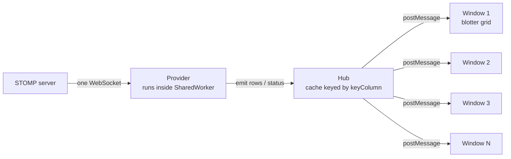
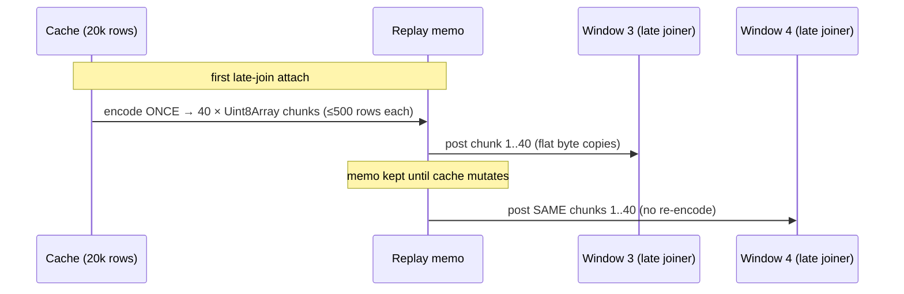
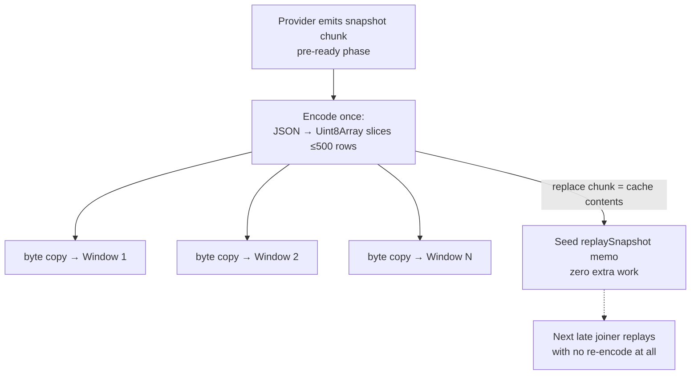
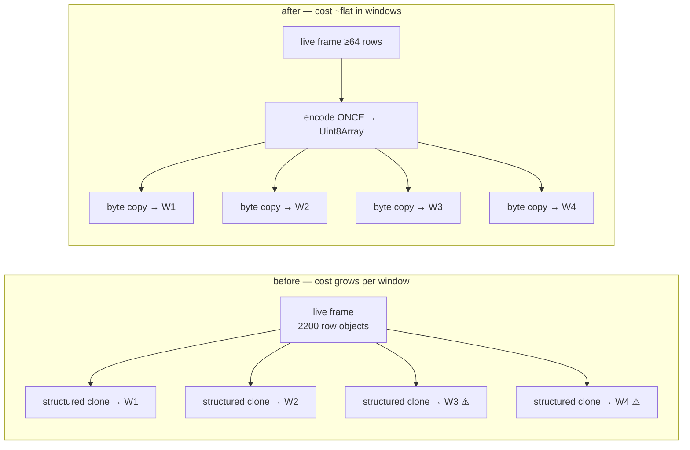
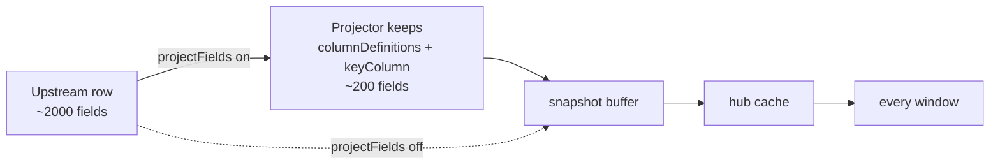

# SharedWorker Hub — High-Volume Fan-Out Optimizations

How the `@starui/host-data` SharedWorker hub publishes large snapshots
and high-rate realtime streams to many subscriber windows, what was
optimized, and the architectural trade-offs behind each choice.

Every section is explained twice: **technical** (left) and **in plain
words** (right).

---

## 1. The starting architecture

| Technical | In plain words |
|---|---|
| All windows of the app share one `SharedWorker`. Each data provider runs **once** inside it, holds one upstream connection, and maintains one row cache (`Map<key, row>`). Windows attach over `MessagePort`s; the hub fans every event out with `postMessage`, which **structured-clones** the payload per port. | Instead of every window dialing the server itself, there is one shared "post office" that downloads the data once and hands a copy to each open window. The catch: *making each copy* is work, and the post office is a single worker — if copying gets expensive, everyone queues. |

**Why this architecture at all:** N windows cost one upstream
connection and one cache. The server never knows how many windows are
open. The price is that the worker thread is a single lane — every
optimization below exists to keep that lane clear.

---

## 2. The two traffic shapes

| Technical | In plain words |
|---|---|
| **Snapshot traffic**: 20,000+ rows delivered once at start/restart, and replayed to every *late-joining* window from the cache. Bursty, large, latency-sensitive (a window is visibly blank until done). | The "load everything" moment — when a blotter opens or you hit Restart, it needs all 20,000 rows before it can show anything. |
| **Realtime traffic**: continuous delta frames (in stress profile ~9 frames/sec × ~2,200 rows = ~20,000 row-updates/sec) that must reach **every** window forever. Steady, unbounded, throughput-sensitive. | The "ticking prices" stream — a firehose that never stops, and every open window drinks the whole thing. |

These two shapes fail differently, so they got different fixes.

---

## 3. Optimization P1/P2 — memoized, pre-encoded snapshot replay

| Technical | In plain words |
|---|---|
| Late-join replay used to structured-clone the whole cache per attaching window. Now the hub lazily builds `slot.replaySnapshot`: the cache serialized to UTF-8 JSON `Uint8Array` chunks of ≤ `LATE_JOIN_CHUNK_SIZE` (500) rows, **once per cache generation**. Every subsequent attach posts the *same buffers* — cloning a `Uint8Array` over `postMessage` is a flat `memcpy`, not an object-graph walk. Any cache mutation invalidates the memo in O(1) (`replaySnapshot = null`); the next attach rebuilds lazily. | Instead of re-photocopying a 20,000-page book for every new reader, the post office prints it once and hands out cheap reprints. If the book changes, the print master is thrown away and remade only when the next reader actually shows up. |
| **Why chunks of 500:** each port message decodes on the receiving window's main thread; 500 rows keeps each decode under Chromium's 50 ms long-task threshold, so the UI never visibly freezes during load. | The book is shipped as thin booklets instead of one heavy box, so the reader can keep flipping pages (the UI keeps responding) while it arrives. |
| **Why UTF-8 JSON bytes and not `ArrayBuffer` transfer:** a transferred buffer is *moved*, not copied — unusable for the second subscriber. Shared chunks must survive N posts, so they're cloned; cloning bytes is the cheap kind of clone. | Handing over the original means the next reader gets nothing. Cheap reprints beat donating the master copy. |

---

## 4. Optimization P3/P4 — allocation discipline on the hot tick path

| Technical | In plain words |
|---|---|
| **P3 — event object reuse:** `broadcastData` reuses ONE event object across the listener loop, rewriting `subId` per listener before each `postMessage` (safe: `postMessage` serializes synchronously). Removes a per-listener-per-tick allocation. | Reuse one envelope and re-address it for each recipient, instead of making a fresh envelope per letter per second. |
| **P4 — lazy deduplication:** the common case (every row keyed, no intra-batch duplicates) broadcasts `event.rows` **by reference** — no dedup `Map`, no copied array. The dedup/drop slow paths only run when the batch actually contains bad keys or duplicates, detected with O(1) size arithmetic where possible. | Don't inspect every package for damage when the sender almost never damages them — only open the boxes when the weight is off. |
| Combined effect: at thousands of row-updates/sec × many subscribers, these were a measurable share of **young-generation GC churn** — the "minor GC" pauses that made dragged windows jitter. | Less paper thrown away per second means the janitor (the garbage collector) interrupts work less often — that's what made dragging windows feel smoother. |

---

## 5. Binary snapshot broadcast on restart (and free replay seeding)

| Technical | In plain words |
|---|---|
| Restart used to fan the fresh snapshot out as plain object deltas — N structured clones of 20k rows in the worker. Now all **pre-ready** row broadcasts (`snapshotReady` clears on every `loading`) ship as `delta-bin`: encode once, byte-copy per port. | When you hit Restart with 10 windows open, the post office used to hand-copy the book 10 times. Now it prints once and reprints 10 times. |
| Because a `replace` broadcast is by construction equal to the cache contents, the broadcast encoding **doubles as the replay memo** (chunk 0 = replace chunk; clean key-appending chunks extend it). The next late joiner replays without any re-encoding. | The reprints made during the restart are kept on the shelf — the next reader who walks in gets one instantly. |
| **Ordering fix that shipped with this:** the provider slot is registered in the hub's `providers` map *before* `startProvider` is called, so a factory that emits `status: loading` synchronously isn't dropped by the identity guard. This fixed the erratic "peer windows don't show the refresh started" bug. | The clerk now signs the new worker in *before* the worker shouts "starting!" — previously the shout sometimes happened before anyone was listening, so other windows never heard the refresh begin. |

---

## 6. Binary realtime fan-out — the multi-window fix

The stress profile (~20k row-updates/sec) exposed the last clone
bottleneck: live ticks.

| Technical | In plain words |
|---|---|
| Post-ready deltas were plain object events: one object-graph structured clone **per listener per frame**. A sweep feed ships thousands of *distinct-key* rows per frame — key conflation cannot shrink it. Each window added ~22 MB/s of clone serialization inside the single worker thread; at 3–4 windows the worker saturated and **late-joiner snapshot replays stalled for minutes behind the backlog**. | Every ticking update was being hand-copied once per open window, inside the one shared post office. Two windows: fine. Four windows: the clerk drowns, and the new window's "send me everything" order sits at the bottom of the pile — that was the stuck blotter. |
| Now any live frame with ≥ `LIVE_BIN_MIN_ROWS` (64) rows broadcasts as `delta-bin`: serialize once, flat byte copy per port. Fan-out cost is ~flat in window count. Frames below 64 rows stay plain object deltas — the encode round-trip doesn't repay itself for small conflated ticks, which are the normal production shape. | Big bundles of updates get the print-once treatment too. Tiny routine updates keep the old direct path, because printing a one-page memo is slower than just handing it over. |
| The client decode path was already phase-agnostic (`delta-bin → JSON.parse → onDelta`), so this was a hub-only change. | The windows already knew how to read reprints — only the post office needed new equipment. |

---

## 7. Field projection — shrink the rows before anything else sees them

| Technical | In plain words |
|---|---|
| Opt-in `cfg.projectFields`: at frame-parse time in the worker — *before* rows enter the snapshot buffer, hub cache, or any port — each row is pruned to the union of `columnDefinitions[].field` paths and `keyColumn` (`createFieldProjector`). Nested `a.b.c` paths copy just the needed subtree; prefix paths win to prevent aliasing. Cuts cache memory, snapshot encode size, every byte copy, and every window's decode by the width ratio (~10× for 2000→200 fields). | If the screen only shows 200 of the 2,000 columns the server sends, throw away the other 1,800 at the front door — then every shelf, reprint, and delivery downstream is a tenth the weight. |
| Visibility: `ProviderStats.cacheBytes` ("Cache size (serialized)" in the Diagnostics tab) reports the serialized cache footprint — exact from the replay memo when present, else a sampled-row × rowCount estimate. Upstream `byteCount` is intentionally separate: projection cannot reduce what the server sends. | The dashboard now shows the weight of what's *kept*, separate from what *arrived* — flipping the switch visibly shrinks the first number; the second is the server's choice. |
| Trade-off: changing visible columns requires a provider restart, and `probeStomp` (Infer Fields) always sees raw rows so discovery still works. | Add a column → restart the feed once. The field-discovery tool still sees everything, so you can always find fields to add. |

---

## 8. Architectural choices and their trade-offs

| Choice | Technical rationale | In plain words |
|---|---|---|
| **Whole-row replacement by key** (no partial/thin deltas) | The cache and every consumer do `cache.set(key, row)` / AG Grid `applyTransactionAsync` with full rows. Thin field-level patches would shrink the wire ~50× for touch updates, but require a merge contract at every hop and break the "row is immutable value" invariant that makes reference-sharing (P4) safe. Rejected for now. | Every update is a complete replacement card, never a sticky note on top of an old card. Bigger to mail, but nobody ever has a half-updated card. |
| **UTF-8 JSON in `Uint8Array`, not a binary columnar format** | JSON keeps one codec everywhere (`JSON.parse` is heavily optimized native code) and the bytes double as the replay memo. A typed-array columnar format would cut decode several-fold but is a protocol rewrite touching every consumer. Deferred. | We standardized on fast photocopies rather than inventing a new shorthand every office would have to learn. The shorthand is the next big win if needed. |
| **Lazy memo + O(1) invalidation** (vs incremental memo maintenance) | Live ticks mutate the cache constantly; keeping the replay encoding incrementally updated per tick would tax the hot path to subsidize the rare attach. Lazy rebuild costs one encode per "attach after mutation" — the right side of the trade at realistic attach rates. | Don't reprint the book after every price tick just in case a reader shows up — reprint when one actually does. |
| **64-row threshold for binary live frames** | Encode+decode ≈ clone serialize+deserialize for one listener; binary only wins when the encode is amortized over listeners or the frame is big. Small conflated ticks (the production norm) keep the zero-copy-feeling direct path. | Use the printing press for books, hand over post-its directly. |
| **Backpressure at the edges, not the hub** | The demo server skips ticks when `ws.bufferedAmount` exceeds 16 MB and budgets its sweep (`SWEEP_ROWS_PER_SEC`); clients throttle/conflate per provider (`throttleMs`, `conflateByKey`). The hub itself never buffers unboundedly — `MessagePort` queues are the only queue. | Slow consumers are slowed at the tap and at the cup — the pipe in the middle is kept dumb and fast. |
| **What stays per-window by design** | Each window must still decode its frames (~22 MB/s in the stress profile) and run AG Grid transactions. That work is inherently per-main-thread; the hub can only make the *copy* cheap, not the *reading*. Window count × stream rate must fit total machine capacity. | The post office got fast, but every reader still has to read their own copy. Ten readers of a firehose is ten readings — physics, not a bug. |

---

## 9. Result summary

| Path | Before | After |
|---|---|---|
| Late joiner attach (20k rows, N windows already open) | full structured clone of cache per attach | one lazy encode, then byte copies; often zero encode (seeded by restart broadcast) |
| Restart with 10 windows | 10 × 20k-row structured clones | 1 encode (40 chunks) + 10 × byte copies, replay memo seeded free |
| Live tick fan-out (big frames) | 1 object-graph clone × N windows per frame (worker saturated at 3–4 windows) | 1 encode + N byte copies (~flat in N); windows 3–4 open normally under full load |
| Live tick fan-out (small conflated frames) | plain delta | unchanged — plain delta (below 64-row threshold) |
| Worker GC pressure | per-listener event allocations + dedup maps every tick | reused event objects, reference-shared row arrays on the clean path |
| Cache memory (2000-field feed, 200 shown) | full rows cached and shipped | ~10× cut with `projectFields`, visible as "Cache size (serialized)" |

Diagnostics: Provider editor → **Diagnostics** tab — `Cache size
(serialized)`, `Bytes received`, publish rates (binary fan-out posts
count as publishes), snapshot fetch time.

Related code:

- `packages/data/host-data/src/runtime/worker/SharedWorkerDataServicesHub.ts` — cache, replay memo, binary fan-out, broadcast loop
- `packages/data/host-data/src/runtime/client/SharedWorkerDataServicesClient.ts` — `delta-bin` decode
- `packages/data/host-data/src/runtime/providers/fieldProjection.ts` — field projection
- `packages/data/host-data/src/runtime/protocol.ts` — wire events, `ProviderStats`
- `apps/demos/stomp-view-server/` — sweep batcher, row profiles, backpressure guard (test feed)
